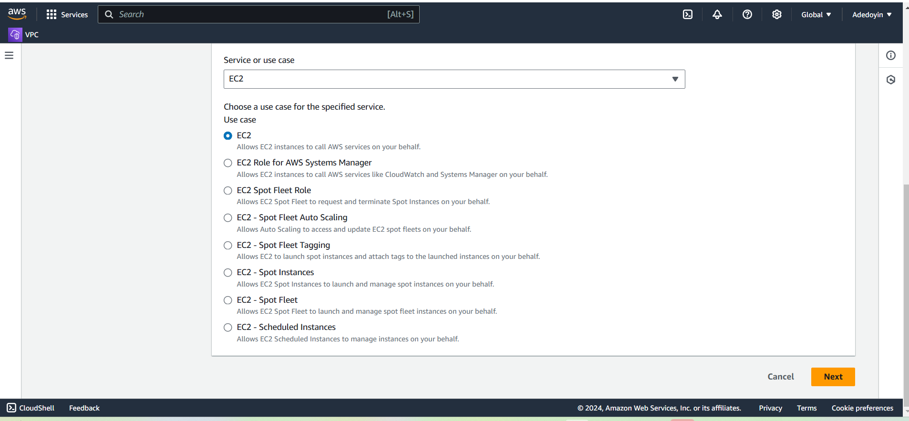

# My Name is Doyin

Welcome to my first project

1. I am strating my project with buying an domain 

2. i spin up an Ubuntu server & assign an elastic IP to it

3. SSH into the server and install Nginz

4. I download freely HTML website 

5. I copy the website file using the Nginx website directory

6. I validate the website using the server IP address 

7. I create a record and add the elastic ip

8. I use DNS to verify my website setup 

9. I install cerbot and Request for an SSL/TLS Certificate

10. I validate my website SSL using the OpenSSL utility

The End of Project 1.