# Prerequisites for Deploying the Prometheus Stack using Docker Compose

- **AWS Account with a Key Pair:** Ensure you have an AWS account and have created a key pair for accessing EC2 instances.
- **AWS CLI Configured:** Install and configure the AWS CLI on your local machine with your AWS account credentials.
- **Terraform Installed:** Make sure Terraform is installed on your local machine for provisioning infrastructure.


## Prometheus Stack Architecture & Workflow


In our setup, we will be using the following components.
 

1. **Prometheus:** Prometheus is an open-source monitoring system designed to collect metrics from various sources, such as application and system performance data, and store them in a time-series database. It scrapes metrics from exporters, processes them, and provides this data to visualization tools like Grafana for real-time monitoring and alerting.

2. **Alert Manager:** Alert Manager is a component of Prometheus that handles alerts based on predefined rules. It routes alerts to various notification channels, such as email, Slack, or other messaging platforms, and provides a centralized dashboard for managing and viewing alert statuses, helping teams quickly respond to potential issues.

3. **Node Exporter:** Node Exporter is an agent for Prometheus that collects hardware and OS-level metrics from Linux systems, such as CPU usage, memory consumption, and disk I/O. These metrics are exposed at the /metrics endpoint, allowing Prometheus to scrape and monitor server performance effectively.

4. **Grafana:** Grafana is a powerful data visualization and monitoring tool that integrates with Prometheus to create interactive and customizable dashboards. It supports various data sources and provides a user-friendly interface for visualizing complex data sets, helping teams analyze and understand system performance and trends.

5. **Terraform:** Terraform is an open-source Infrastructure as Code (IaC) tool developed by HashiCorp that allows developers to define and provision infrastructure using a high-level configuration language. It supports multiple cloud providers and helps automate the creation, updating, and versioning of infrastructure resources, making infrastructure management efficient and repeatable.

6. **Docker:** Docker is a platform for developing, shipping, and running applications in containers, which are lightweight and portable units that package an application and its dependencies. Docker ensures consistency across different environments, simplifies the deployment process, and isolates applications, making it easier to manage and scale.

7. **Docker Compose:** Docker Compose is a tool for defining and running multi-container Docker applications using a simple YAML file. It allows users to configure application services, networks, and volumes, making it easy to deploy and manage multi-container environments by handling service dependencies and orchestration.


# Spin up an Ubuntu 24.04 EC2 instance we shall be using it for this project

Connect your instance via ssh


Clone the project repository to your instance
```
git clone https://github.com/TobiOlajumoke/prometheus-observability-stack
```
 

The project code is present in the prometheus-observability-stack folder. cd into the folder.
```
cd prometheus-observability-stack
```
 

Note: Use visual studio code or relevant IDE to understand the code structure better.

Here is the project structure and config files:
```

├── Makefile
├── README.md
├── alertmanager
│   └── alertmanager.yml
├── docker-compose.yml
├── prometheus
│   ├── alertrules.yml
│   ├── prometheus.yml
│   └── targets.json
└── terraform-aws
    ├── README.md
    ├── modules
    │   ├── ec2
    │   │   ├── main.tf
    │   │   ├── outputs.tf
    │   │   ├── user-data.sh
    │   │   └── variables.tf
    │   └── security-group
    │       ├── main.tf
    │       ├── outputs.tf
    │       └── variables.tf
    ├── prometheus-stack
    │   ├── main.tf
    │   ├── outputs.tf
    │   └── variables.tf
    └── vars
        └── ec2.tfvars
```
Let’s understand the project files.

The alertmanager folder contains the alertmanager.yml file which is the configuration file. If you have details of the email, slack, etc. we can update accordingly.

The prometheus folder contains alertrules.yml which is responsible for the alerts to be triggered from the prometheus to the alert manager. The prometheus.yml config is also mapped to the alert manager endpoint to fetch, Service discovery is used with the help of a file `file_sd_configs` to scrape the metrics using the targets.json file.

terraform-aws directory allows you to manage and isolate resources effectively. modules contain the reusable terraform code. These contain the Terraform configuration files (main.tf, outputs.tf, variables.tf) for the respective modules.

The ec2 module also includes user-data.sh script to bootstrap the EC2 instance with Docker and Docker Compose. The security group module will create all the inbound & outbound rules required.

Prometheus-stack Contains the configuration file main.tf required for running the terraform. Vars contains an ec2.tfvars file which contains variable values specific to all the files for the terraform project.

The Makefile is used update the provisioned AWS EC2’s public IP address within the configuration files of prometheus.yml and targets.json located in the prometheus directory.

The docker-compose.yml file incorporates various services Prometheus, Grafana, Node exporter & Alert Manager. These services are mapped with a network named ‘monitor‘ and have an ‘always‘ restart flag as well.


## To do this project you need to have the following.

1. A Valid AWS account with full permissions to create and manage AWS VPC service.
2. Setup terraform on an ec2 instance, ensure you have a valid IAM role attached to the instance with VPC provisioning permissions.


We are going to spin up an ec2 instance and attach the following IAM roles to it:

- AmazonVPCFullAccess
- AmazonEC2FullAccess
    
 
  
   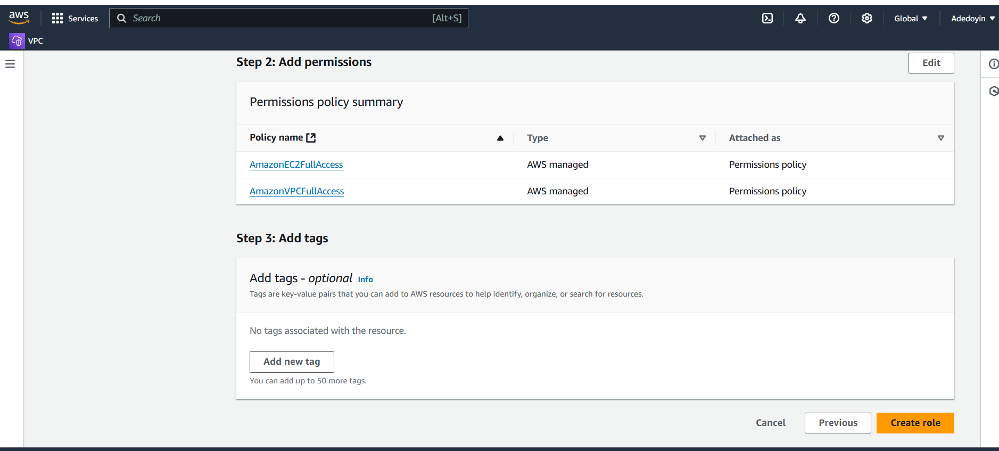
   

## Now create an EC2 instance, Ubuntu 22.04


## let us the attach the role created earlier to the instance
 


##  Connect to your instance via ssh 

- ssh into the instance
- install terraform
```
sudo snap install terraform --classic

```
 

# Provision Server Using Terraform
Modify the values of ec2.tfvars file present in the terraform-aws/vars folder. You need to replace the values highlighted in bold with values relevant to your AWS account & region.


```
cd terraform-aws/vars
```
 

If you are using us-west-2, you can continue with the same AMI ID else change the AMI ID 
```
vi ec2.tfvars
```
 

```
# EC2 Instance Variables
region         = "us-west-2"
ami_id         = "ami-0aff18ec83b712f05"
instance_type  = "t2.large"
key_name       = "devoproject"
instance_count = 1
volume-size = 20

# VPC id
vpc_id  = "vpc-0538b0a6c89f2ebf0"
subnet_ids     = "subnet-08c3acfafd5341ba0"

# Ec2 Tags
name        = "prometheus-stack"
owner       = "devops-mastery"
environment = "dev"
cost_center = "devops-project"
application = "monitoring"

# CIDR Ingress Variables
create_ingress_cidr        = true
ingress_cidr_from_port     = [22, 80, 443, 9090, 9100, 9093, 3000]  # List of from ports
ingress_cidr_to_port       = [22, 80, 443, 9090, 9100, 9093, 3000]  # List of to ports
ingress_cidr_protocol      = ["tcp", "tcp", "tcp", "tcp", "tcp", "tcp", "tcp"]        # Protocol for all rules (you can add more if needed)
ingress_cidr_block         = ["0.0.0.0/0", "0.0.0.0/0", "0.0.0.0/0", "0.0.0.0/0", "0.0.0.0/0", "0.0.0.0/0", "0.0.0.0/0"]
ingress_cidr_description   = ["SSH", "HTTP", "HTTPS", "Prometheus", "Node-exporter", "Alert manager", "Grafana"]

# CIDR Egress Variables
create_egress_cidr    = true
egress_cidr_from_port = [0]
egress_cidr_to_port   = [0]
egress_cidr_protocol  = ["-1"]
egress_cidr_block     = ["0.0.0.0/0"]

```

Now we can provision the AWS EC2 & Security group using Terraform.

```
cd ../prometheus-stack

```
 

```
terraform fmt
```
 

```
terraform init
```
 

```
terraform validate
```
 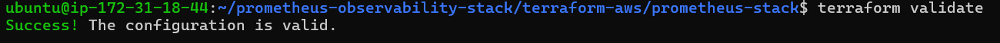


Execute the plan and apply the changes.

```


terraform plan --var-file=../vars/ec2.tfvars
```
 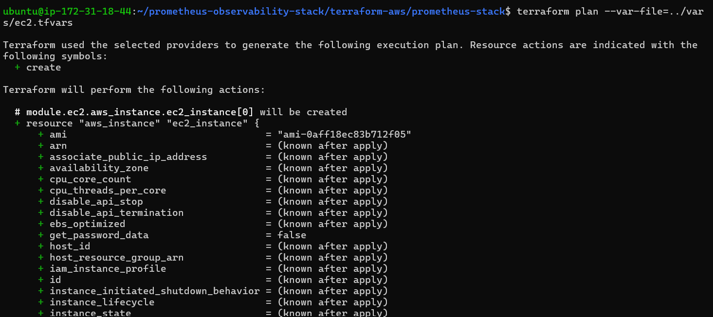

```
terraform apply --var-file=../vars/ec2.tfvars
```
 

Before typing ‘yes‘ make sure the desired resources are being created. After running Terraform Output should look like the following:

Apply complete! Resources: 2 added, 0 changed, 0 destroyed.

Outputs:
 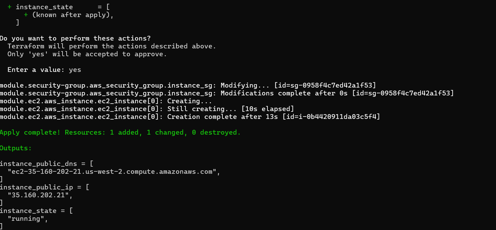

Now we can connect to the AWS EC2 machine just created via ssh. 


# CONNECT TO YOUR NEW INSTANCE 

In previous projeect you've seen how to ssh into an instance

 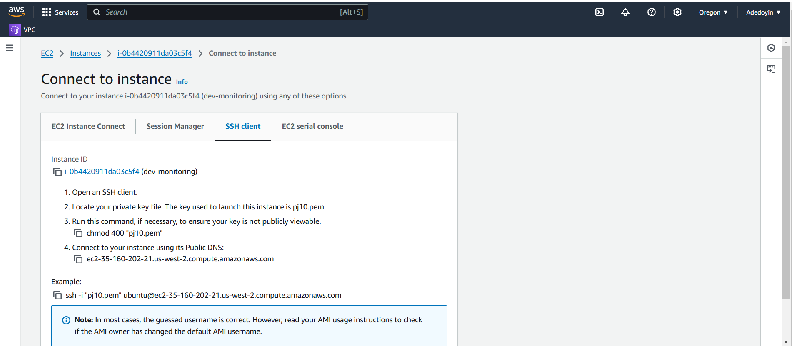

- let's run the following command on our instance

We will check the cloud-init logs to see if the user data script has run successfully.

```
tail /var/log/cloud-init-output.log
```

An example output is shown below. It should show Docker and Docker compose versions as highlighted in the image.


 

Let’s verify the docker and docker-compose versions again.

```
sudo docker version

```
 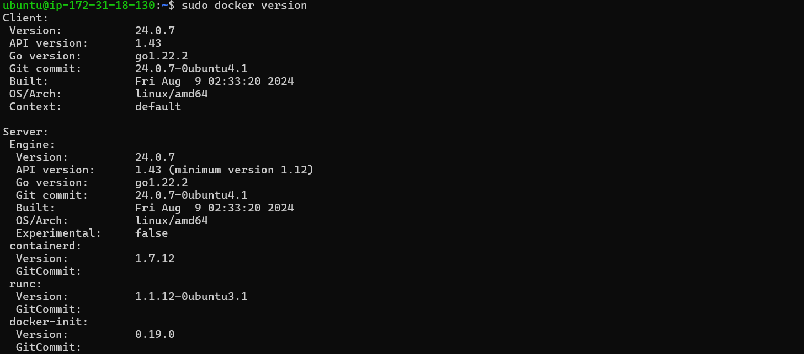

```
sudo docker-compose version
```
 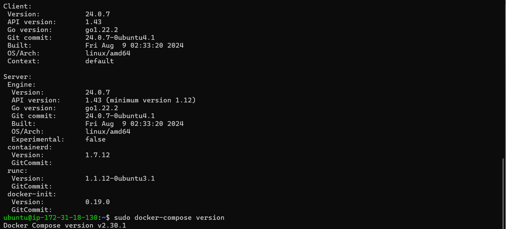


Now that we have the instance ready with the required utilities, let’s deploy the Prometheus stack using docker-compose.

# Deploy Prometheus Stack Using Docker Compose
First, clone the project code repository to the server.
```
git clone https://github.com/TobiOlajumoke/prometheus-observability-stack
```
 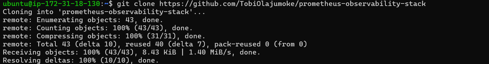

```
cd prometheus-observability-stack
```
 

Execute the following make command to update server IP in prometheus config file. Because we are running the node exporter on the same server to fetch the server metrics. We also update the alert manager endpoint to the servers public IP address.
```
make all
```
 

You should see an output as shown below.


## Bring up the stack using Docker Compose. It will deploy Prometheus, Alert manager, Node exporter and Grafana

```
sudo docker-compose up -d
```

On a successful execution, you should see the following output saying Running 5/5

 

Now, with your servers IP address you can access all the apps on different ports.

1. Prometheus: http://your-public-ip-address:9090
2. Alert Manager: http://your-public-ip-address:9093
3. Grafana: http://your-public-ip-address:3000
4. Now the stack deployment is done. The rest of the configuration and testing will be done the using the GUI.

# Validate Prometheus Node Exporter Metrics
If you visit http://your-public-ip-address:9090, you will be able to access the Prometheus dashboard as shown below.

Validate the targets, rules and configurations as shown below. The target would be Node exporter url.

 
  


### validating prometheus rules and targets
Now lets execute a promQL statement to view node_cpu_seconds_total metrics scrapped from the node exporter.
```
avg by (instance,mode) (irate(node_cpu_seconds_total{mode!='idle'}[1m]))
```
   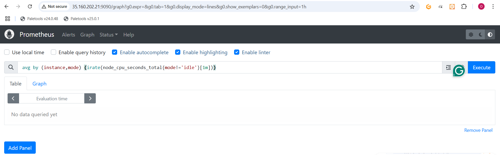
    
     
executing a promQL statement to get graph

# Configure Grafana Dashboards
Now lets configure Grafana dashboards for the Node Exporter metrics.

Grafana can be accessed at: http://your-ip-address:3000

Use admin as username and password to login to Grafana. You can update the password in the next window if required.

Now we need to add prometheus URL as the data source from Connections→ Add new connection→ Prometheus → Add new data source.

Here is the demo.


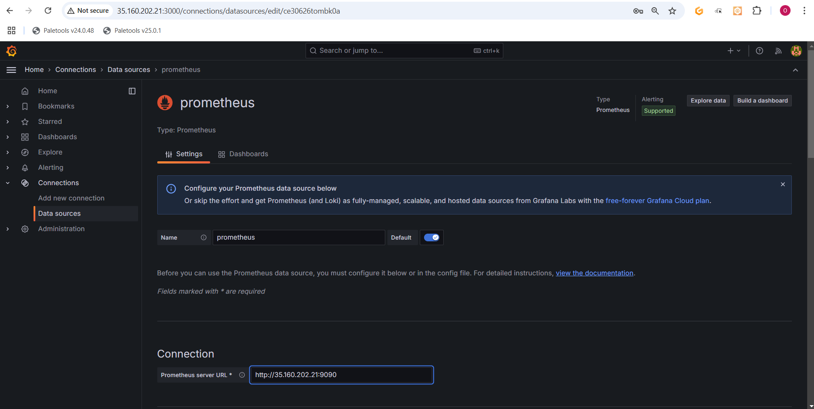
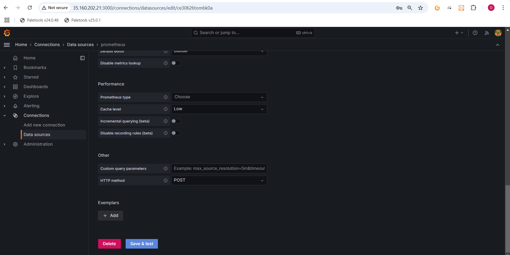


# Configure Node Exporter Dashboard
Grafana has many node exporter pre-built templates that will give us a ready to use dashboard for the key node exporter metrics.

To import a dashboard, go to Dashboards –> Create Dashboard –> Import Dashboard –> Type 10180 and click load –> Select Prometheus Data source –> Import

Here is the demo.
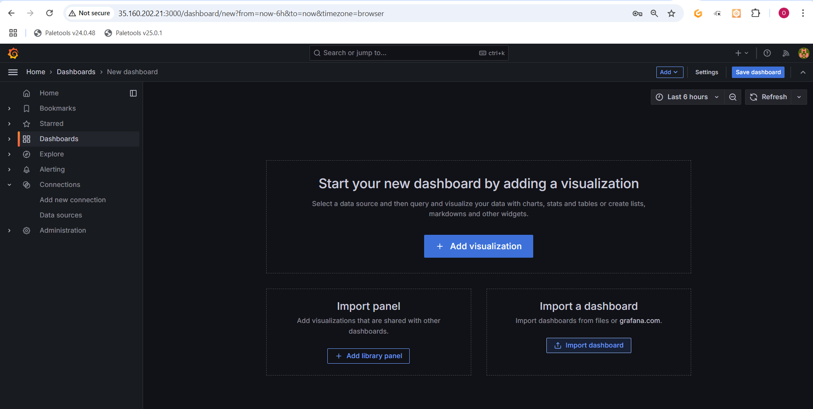
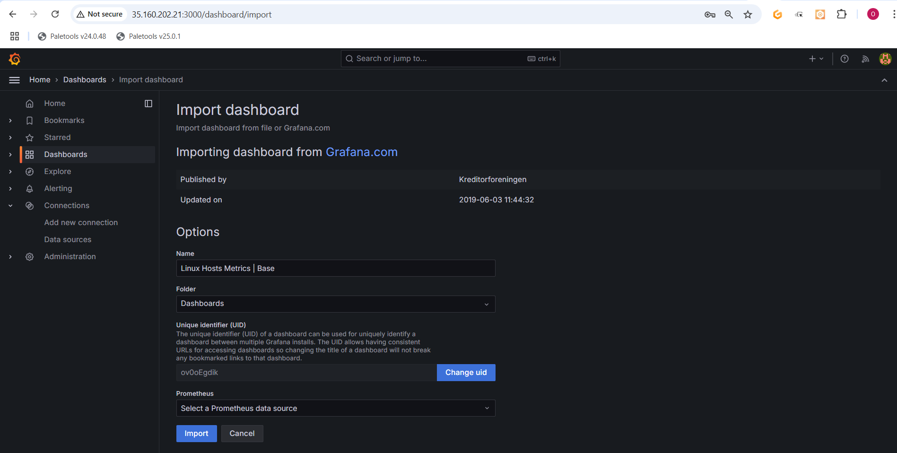


Once the dashbaord template is imported, you should be able to see all the node exporter metrics as shown below.


# Simulate & Test Alert Manager Alerts
You can access the Alertmanager dashbaord on http://your-ip-address:9093


Alert rules are already backed in to the prometheus configuration through alertrules.yaml. If you go the alerts option in the prometheus menu, you will be able to see the configured alerts as shown below.
 http://your-ip-address:9090


As you can see, all the alerts are in inactive stage. To test the alerts, we need to simulate these alerts using few linux utilities.

You can also check the alert rules using the native promtool prometheus CLI. We need to run promtool command from inside the prometheus container as shown below.
run the commands below in the prometheus server

```
sudo docker exec -it prometheus promtool check rules /etc/prometheus/alertrules.yml
```
# Test: High Storage & CPU Alert
```
dd if=/dev/zero of=testfile_16GB bs=1M count=16384; openssl speed -multi $(nproc --all) &
```
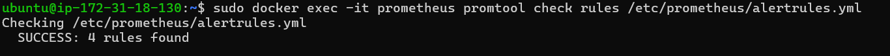

Now we can check the Alert manager UI to confirm the fired alerts.

Now let’s rollback the changes and see the fired alerts has been resolved.

```
rm testfile_16GB && kill $(pgrep openssl)
```

# Cleanup The Setup
To tear down the setup, execute the following terraform command from your workstation.
```
cd prometheus-observability-stack/terraform-aws/prometheus-stack
```
```

terraform destroy --var-file=../vars/ec2.tfvars
```
enter 'yes'

 

## Terminate the  ec2 instances

# THE END


