- Spin up my 3 ubuntu servers.

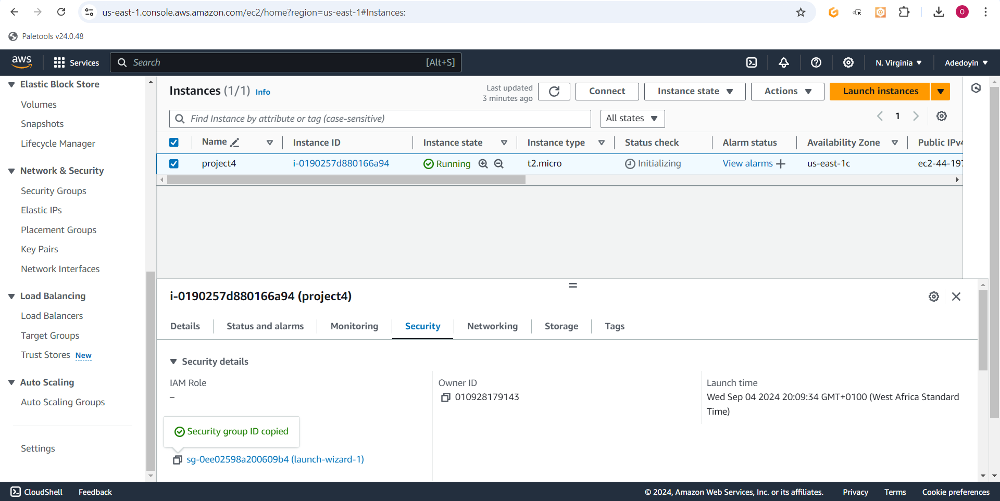

### Install Nginx and Setup Your Website

- Download your website template from your preferred website by navigating to the website, locating the template you want.

- Right click and select **Inspect** from the drop down menu.

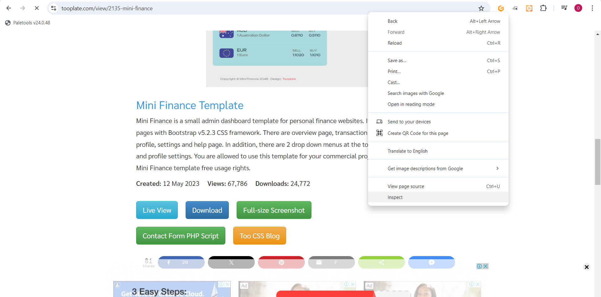

- Click on the **Network** tab.
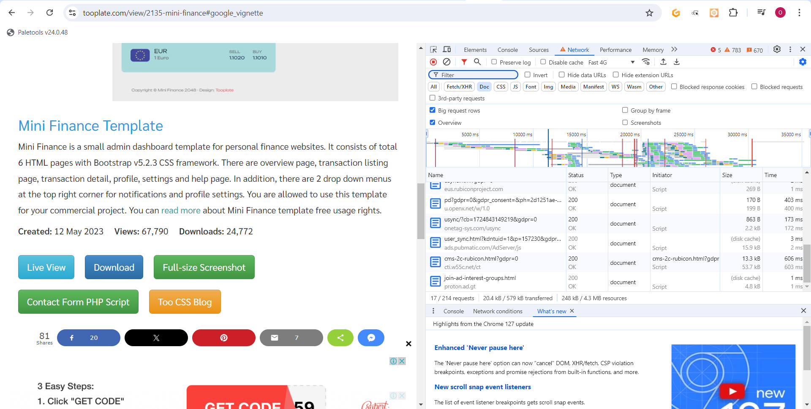

- Click the **Download** button and **right click on the website name**

- Select **Copy** and click on **Copy URL**.

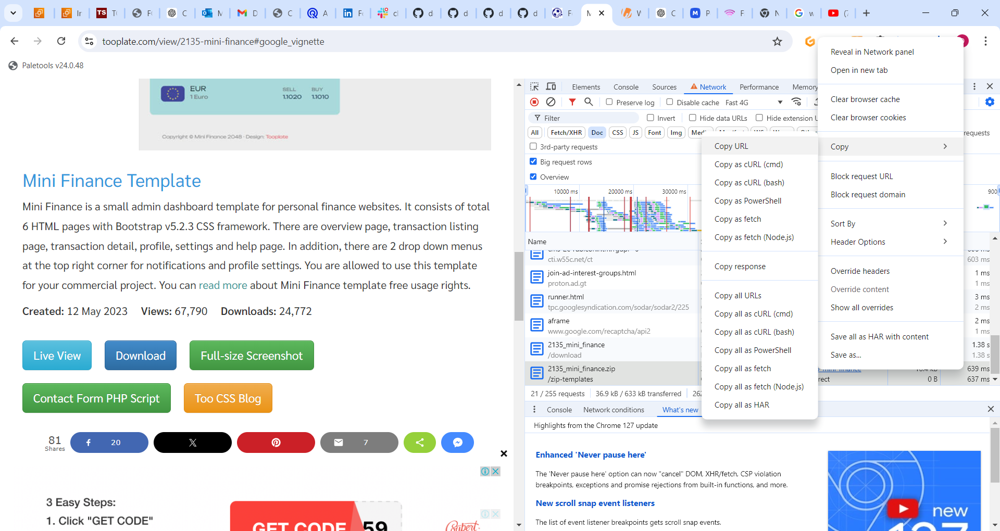

- To install Nginx, I execute the following commands on my terminal.

`sudo apt update`

`sudo apt upgrade`

`sudo apt install nginx`

- I start my Nginx server by running the `sudo systemctl start nginx` command, i enable it to start on boot by executing `sudo systemctl enable nginx`, and then i confirm if it's running with the `sudo systemctl status nginx` command.

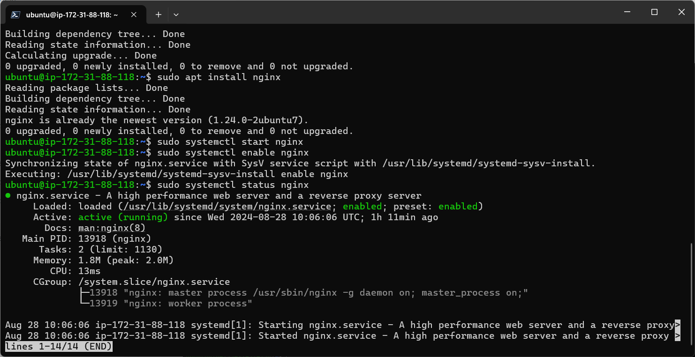

> [!NOTE]
Install Nginx on both web server terminals. These are the terminals you're using to manage the servers hosting the two distinct website contents that the load balancer will distribute traffic to.

- Visit your instances IP address in a web browser to view the default Nginx startup page.

- Execute `sudo apt install unzip` to install the unzip tool and run the following command to download and unzip your website files `sudo curl -o /var/www/html/2135_mini_finance.zip https://www.tooplate.com/zip-templates/2135_mini_finance.zip && sudo unzip -d /var/www/html/ /var/www/html/2135_mini_finance.zip && sudo rm -f /var/www/html/2135_mini_finance.zip`.
  
  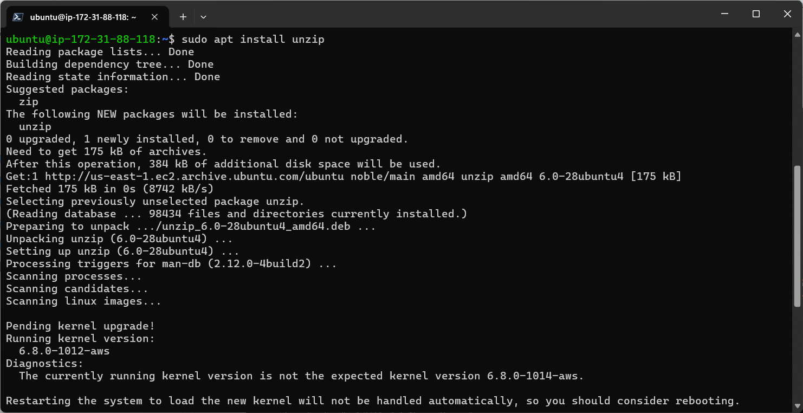

  - To set up my website's configuration, I started by creating a new file in the Nginx sites-available directory. Use the following command to open a blank file in a text editor: `sudo nano /etc/nginx/sites-available/finance`.

- Edit the `root` directive within your server block to point to the directory where your downloaded website content is stored.

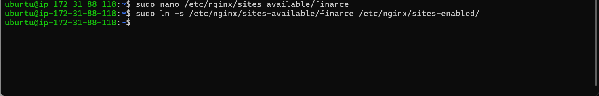

- Run the `sudo nginx -t` command to check the syntax of the Nginx configuration file, and when successful run the `sudo systemctl restart nginx` command.

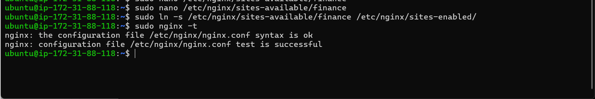

- Repeat the process for the second website.

> [!NOTE]
On your first server, run `sudo rm /etc/nginx/sites-enabled/default`, and on your second server, run `sudo rm /etc/nginx/sites-enabled/default`. This will delete the default site-enabled folders and enable Nginx to serve content from your specified website directories. If you don't delete these default folders, you'll continue to see the default Nginx page.

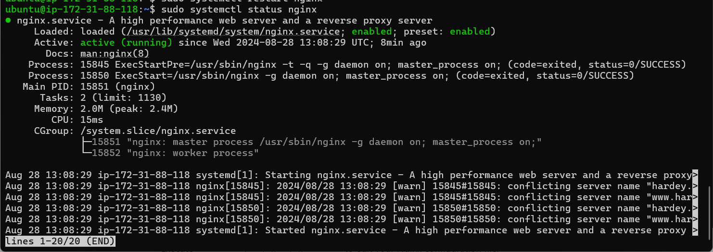

- Run the `sudo systemctl restart nginx` command to restart your server.

- Check both IP addresses to confirm your website is up and running.

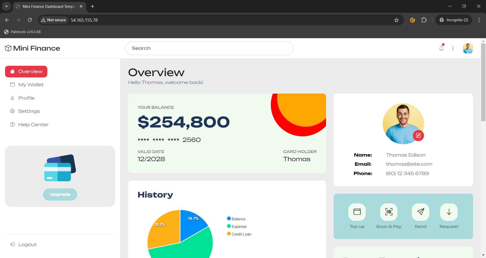

---

### Configure your Load balancer

- Install Nginx on the server you want to use as a load balancer, and execute `sudo systemctl status nginx` to ensure it's running.

- Execute `sudo nano /etc/nginx/nginx.conf` to edit your Nginx configuration file.

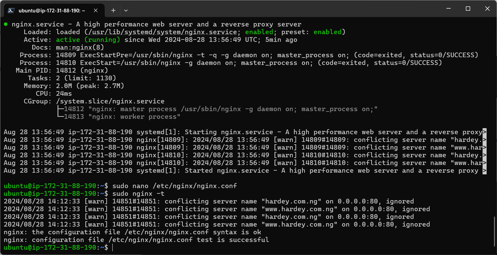

> [!NOTE]
Replace the necessary placeholders as shown in the picture above. Substitute `<server 1>` and `<server 2>` with the actual private IP addresses of your servers. Also, replace `<your domain> www.<your domain>` with your root domain and subdomain name, and update proxy_pass and the other relevant fields accordingly.

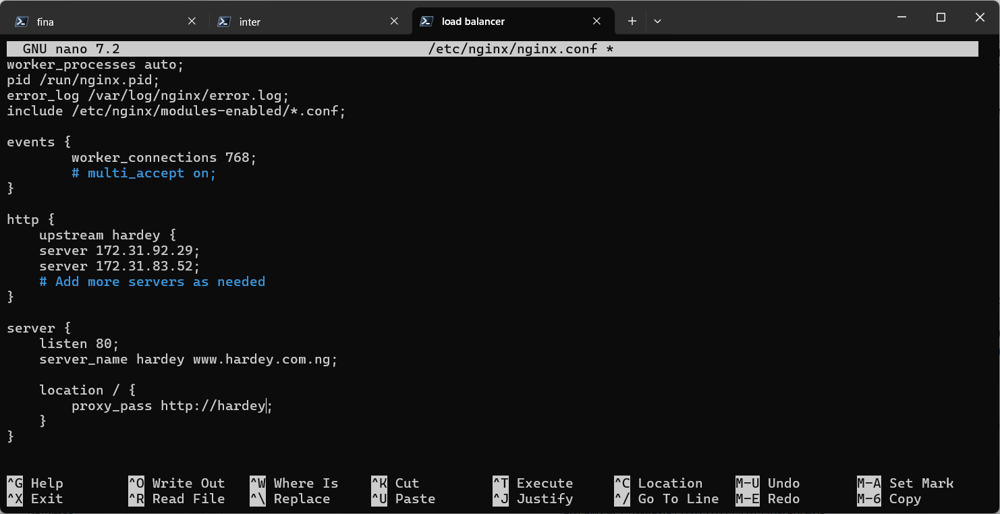

- Run `sudo nginx -t` to check for syntax error.

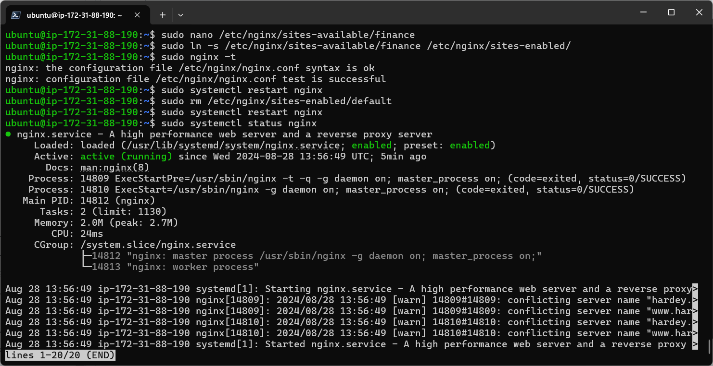

- Apply the changes by restarting Nginx:
`sudo systemctl restart nginx`

---

### Create An A Record
- Point your domain's DNS records to the IP addresses of your Nginx load balancer server.

- In route 53, select the domain name and click on **Create record**.

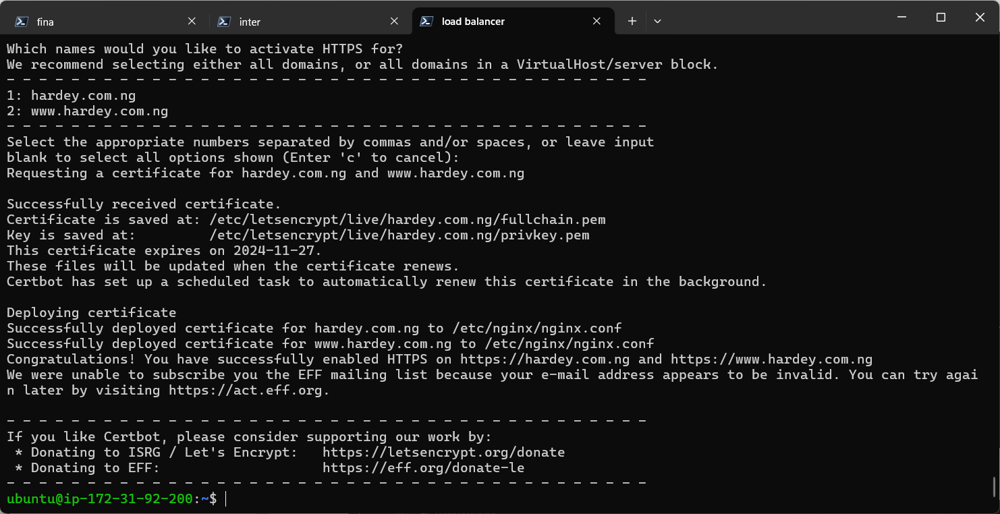

- Paste my **IP address➀** and then click on **Create records➁** to create the root domain.

- Click on **create record** again, to create the record for your sub domain.

- Paste your IP address➀, input the Record name(**www➁**) and then click on **Create records**➂.

- Go to the terminal you used in setting your first website and run `sudo nano /etc/nginx/sites-available/finance` to edit your settings. Enter the name of your domain and then save your settings.

- Restart your nginx server by running the `sudo systemctl restart nginx` command.

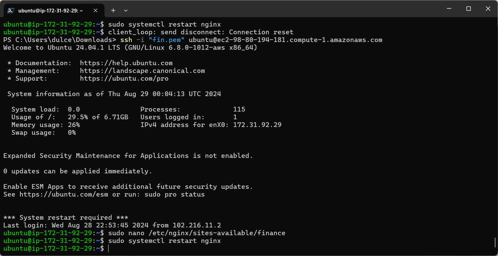

- Go to the terminal you used in setting your second website and run `sudo nano /etc/nginx/sites-available/interior` to edit your settings. Enter the name of your domain and then save your settings.

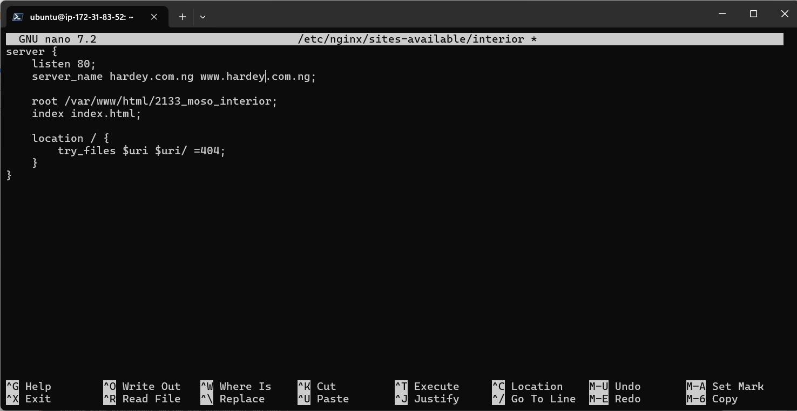

- Restart your nginx server by running the `sudo systemctl restart nginx` command.

- Reload the webpage to ensure the load balancer distributes traffic evenly between your servers.

---

### Install certbot and Request For an SSL/TLS Certificate

- Install certbot by executing the following commands:
`sudo apt update`
`sudo apt install python3-certbot-nginx`

- Execute the `sudo certbot --nginx` command to request your certificate. Follow the instructions provided by certbot and select the domain name for which you would like to activate HTTPS.

- You should get a congratulatory message that says https has been successfully enabled.

- Access your website to verify that Certbot has successfully enabled HTTPS.

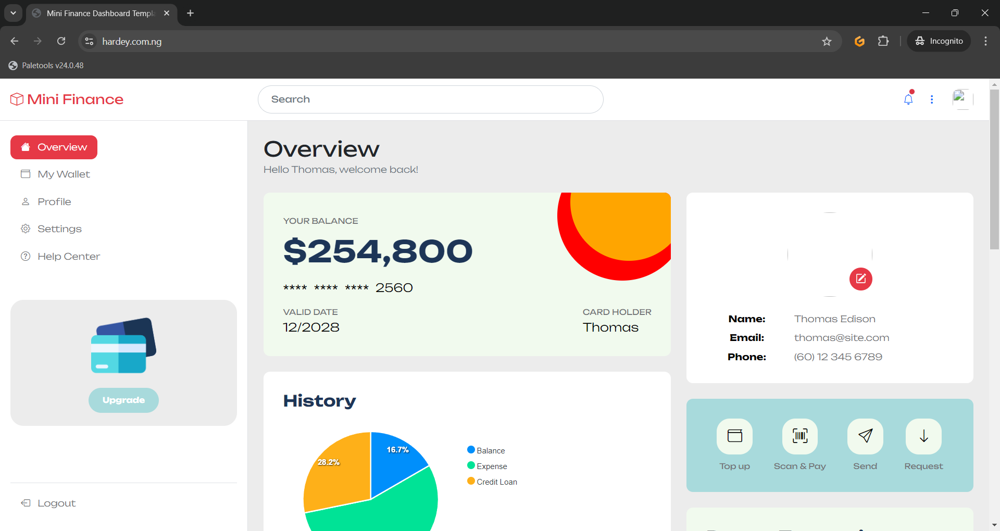

- It is recommended to renew your LetsEncrypt certificate at least every 60 days or more frequently. You can test renewal command in dry-run mode:
`sudo certbot renew --dry-run`

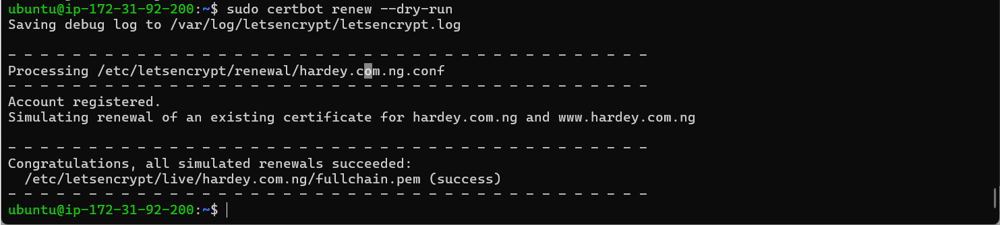

---
---

#### The End Of Project 3

