# Setup WordPress Website Using LAMP Stack

Setting up a WordPress website using the LAMP stack (Linux, Apache, MySQL, PHP).

**Key Features:**

- Step-by-step instructions for installing and configuring LAMP components.
- Secure database creation for your WordPress website.
- User-friendly guide for completing the WordPress installation process.

**Benefits:**

- Gain independence by managing your own WordPress website.
- Understand the core technologies behind WordPress.
- Customize your website to your exact needs.
- Embrace the flexibility and power of WordPress.

## Introduction

Before we begin, let's review the tools we'll be using throughout this project.

### Linux

Linux is the cornerstone of the LAMP stack, serving as the operating system that underpins the entire infrastructure. As an open-source and highly customizable platform, Linux provides a stable and secure environment for hosting web applications. Its efficiency in handling processes and resources makes it an ideal choice for web servers. In a LAMP stack, Linux coordinates the interaction between Apache (the web server), MySQL (the database), and PHP (the scripting language), ensuring seamless operation and communication between these components. This foundation allows for high performance, flexibility, and scalability, making Linux a crucial element in the successful deployment and management of a LAMP-based WordPress website.

### Apache

Apache is a critical component of the LAMP stack, acting as the web server that handles client requests and serves web content. As an open-source and widely used web server software, Apache is known for its reliability, security, and flexibility. In a LAMP stack, Apache processes incoming HTTP requests, fetching and delivering web pages to users' browsers. It also supports various modules that extend its functionality, such as URL redirection, authentication, and load balancing. By efficiently managing web traffic and providing a stable platform for running web applications, Apache ensures that your WordPress website runs smoothly and can handle a large number of concurrent users.

### MySQL

MySQL is the database management system within the LAMP stack, responsible for storing and managing the data that powers your web applications. As an open-source relational database, MySQL offers robust performance, scalability, and security. In the context of a LAMP stack, MySQL works closely with PHP to handle data operations such as storing user information, retrieving content, and managing transactions. For a WordPress website, MySQL stores all the content, user data, settings, and other essential information, allowing for dynamic content generation and efficient data retrieval. By ensuring data integrity and providing powerful querying capabilities, MySQL plays a crucial role in maintaining the functionality and performance of a WordPress site on the LAMP stack.

### PHP

PHP is the scripting language in the LAMP stack, responsible for generating dynamic web content. As a server-side language, PHP processes code on the web server to create HTML content that is then sent to the user's browser. In the LAMP stack, PHP works in tandem with Apache to handle web requests and interact with the MySQL database to retrieve and manipulate data. For a WordPress website, PHP executes the core logic that powers the site, managing everything from user authentication to content management and plugin functionality. By seamlessly integrating with Apache and MySQL, PHP ensures that your WordPress site is dynamic, interactive, and capable of delivering a rich user experience.

---


|S/N | Project Tasks                                                       |
|----|---------------------------------------------------------------------|
| 1  |Deploy an Ubuntu Server                                              |
| 2  |Set up your LAMP stack on the server                                 |
| 3  |Configure the wordpress Application                                  |
| 4  |Map the IP address to the DNS A record                               |
| 5  |Validate the WordPress website setup by accessing the web address.   |

## Key Concepts Covered

- AWS (EC2 and Route 53)
- Linux(Ubuntu)
- Apache
- MySQL
- PHP
- Wordpress
- DNS
- SSL (certbot)
- OpenSSL command

## Documentation
- Seting an inbound rule for MYSQL in my security group.


- Edit inbound rules.

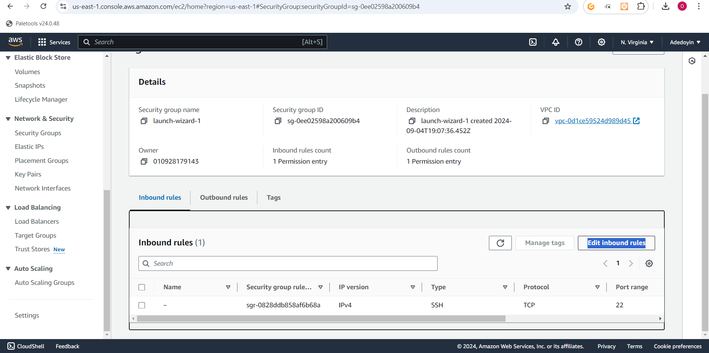

- Add rule.

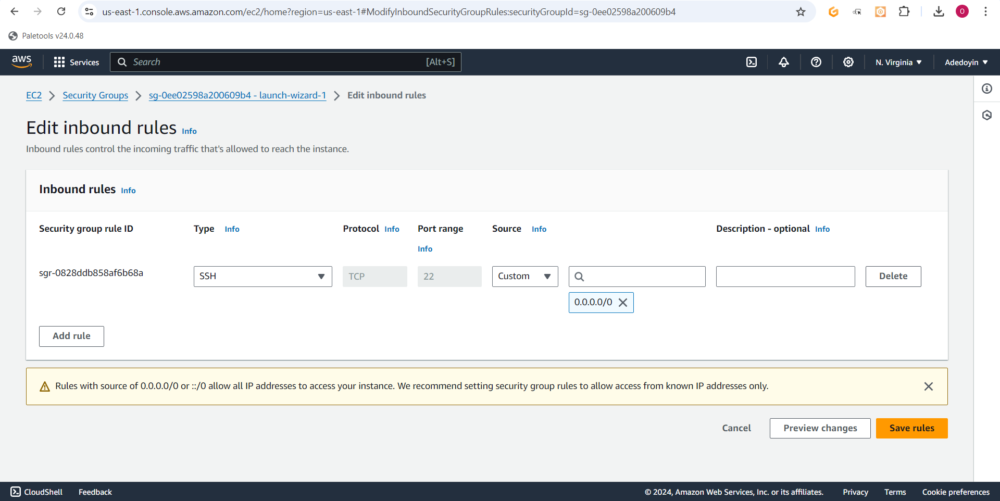

- Using **MySQL/Aurora** and adding my **ip address**.

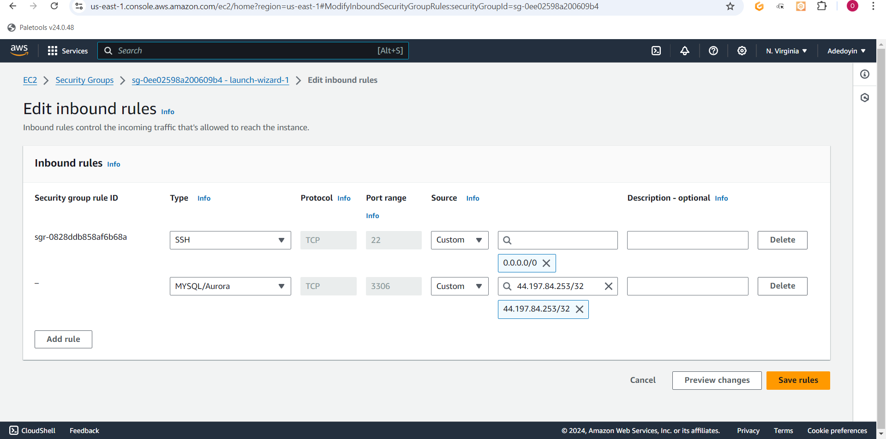

- open my terminal and connect my Ubuntu server via ssh

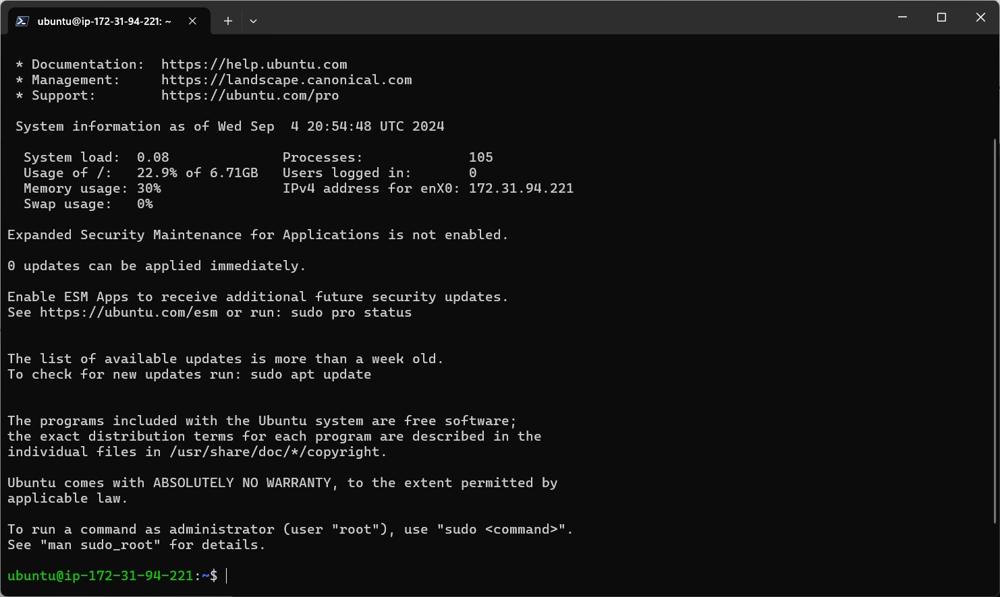

### Install Apache

- To install Apache, run the following commands in your terminal.

**`sudo apt update`**


**`sudo apt install apache2`**

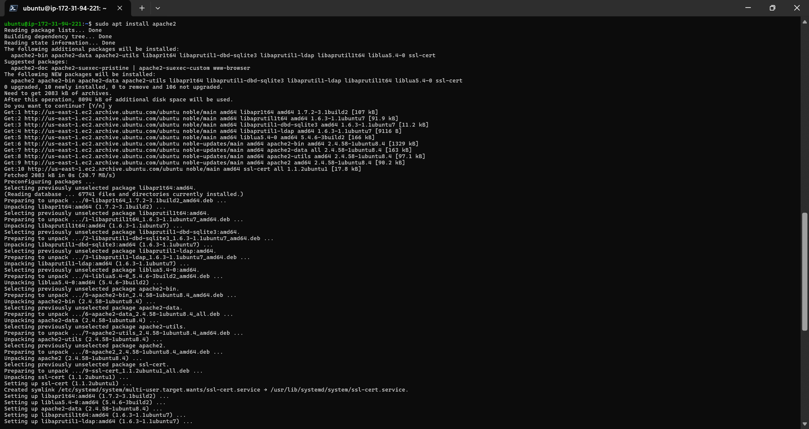

- To enable Apache to start on boot, execute **`sudo systemctl enable apache2`**, and then verify its status with the **`sudo systemctl status apache2`** command.

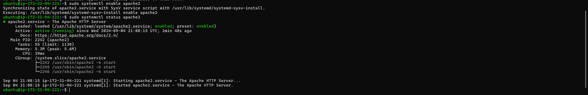

- Now, let's check if our server is running and accessible both locally and from the Internet by executing the following command: **`curl http://localhost:80`**.

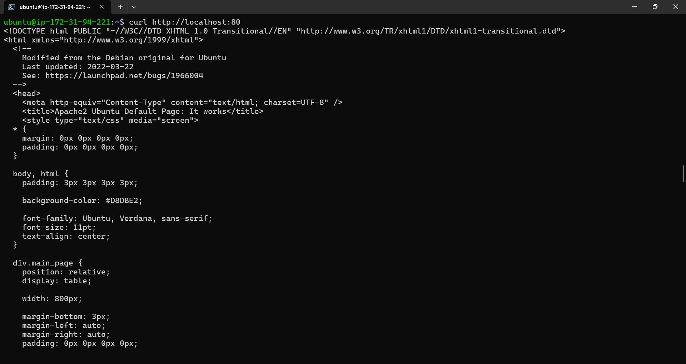

 I will be checking if my Apache HTTP server respond to request from the internet by using **`http://<Public-IP-Address>:80`**.

 -This image shows it was successfull u=install.

 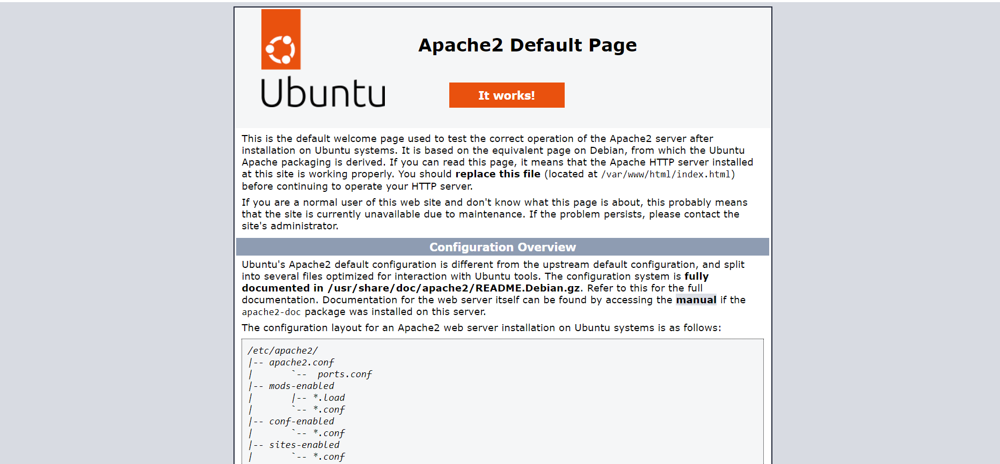

 ### Install MYSQL

- To install this software using 'apt', run the command **`sudo apt install mysql-server`**. When prompted, confirm the installation by typing 'Y' and then pressing ENTER.

 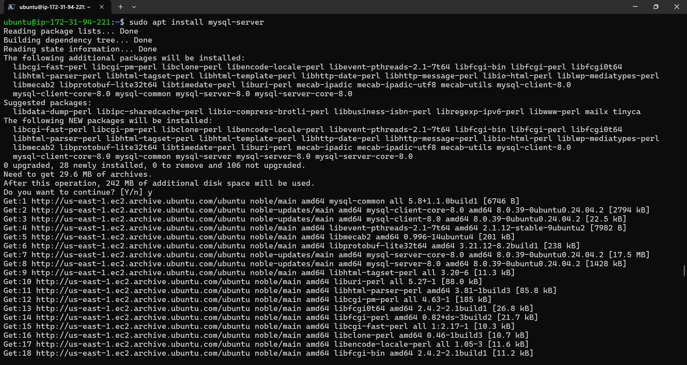

 - After the installation is complete, i log in to the MySQL console by typing: **`sudo mysql`**.

 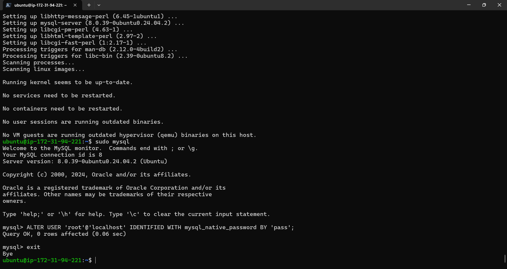
 
 - i Start the interactive script by running: **`sudo mysql_secure_installation`**. Answer **y** key to continue.


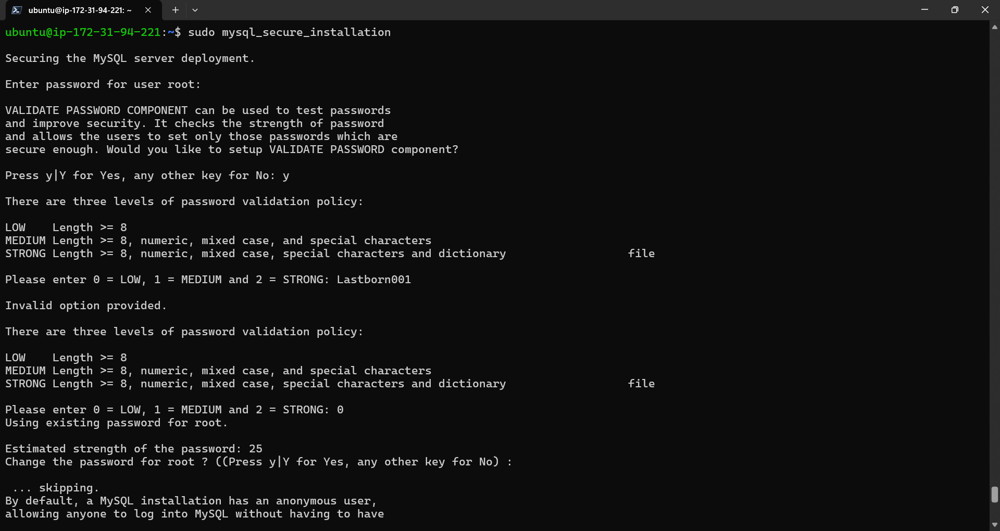

- Set your **password validation policy level**.

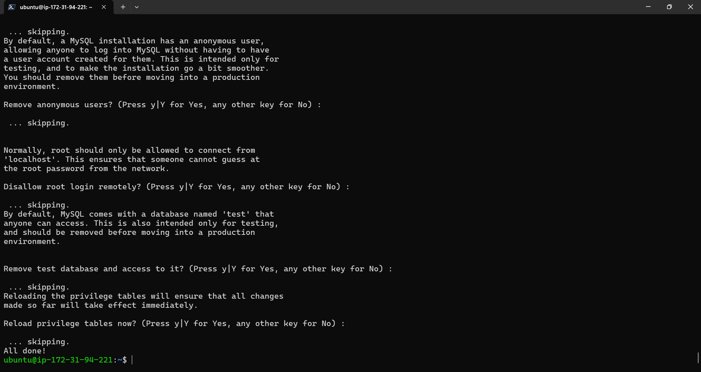

- Enable MySQL to start on boot by executing **`sudo systemctl enable mysql`①**, and then confirm its status with the **`sudo systemctl status mysql`②** command.

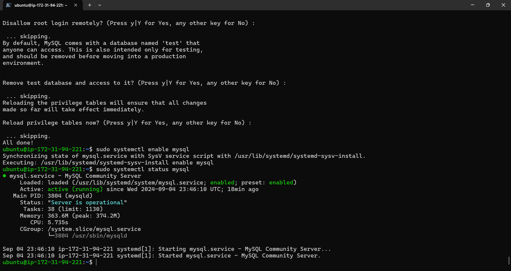

### Install PHP

- Install PHP along with required extensions by running the following script: **`sudo apt install php-curl php-gd php-mbstring php-xml php-xmlrpc php-soap php-intl php-zip`**.

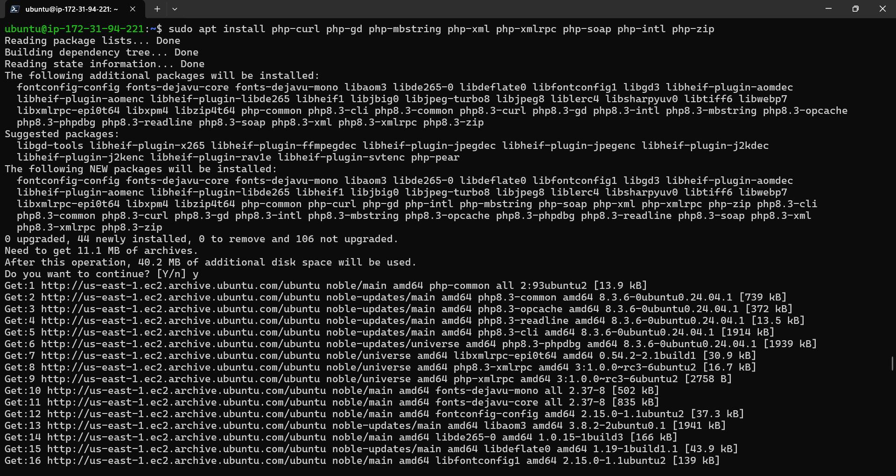

Ruuning this following comand.

**`sudo apt install php libapache2-mod-php php-mysql`**

- Confirm the downloaded PHP version by running **`php -v`**.

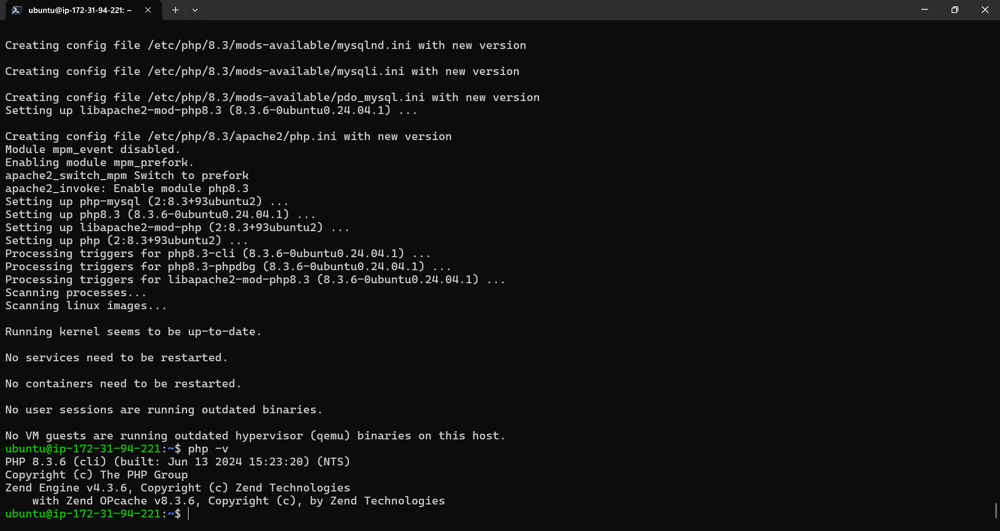

### Creating A Virtual Host For Your Website Using Apache

- Create the directory for Projectlamp using the 'mkdir' command as follows:
**`sudo mkdir /var/www/projectlamp`** and assign ownership of the directory to our current system user using:
**`sudo chown -R $USER:$USER /var/www/projectlamp`**.

- I create and open a new configuration file in Apache's sites-available directory using your preferred command-line editor:
**`sudo vi /etc/apache2/sites-available/projectlamp.conf`**.

- Creating this will produce a new blank file. then i input the configuration text.

i save my changes with **ESC** and the type **:wq** and press **ENTER**

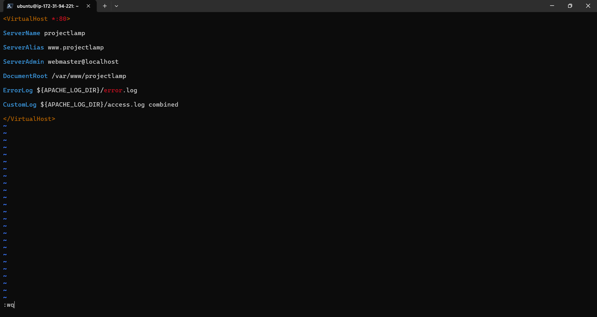

- I run the ls command **`sudo ls /etc/apache2/sites-available`** to show the **new file②** in the sites-available directory.


- i enable the new virtual host using the a2ensite command: **`sudo a2ensite projectlamp`**.


- I disable Apache's default website, use the a2dissite command. **`sudo a2dissite 000-default`**.


- To ensure your configuration file doesn’t contain syntax errors, i run: **`sudo apache2ctl configtest`**.

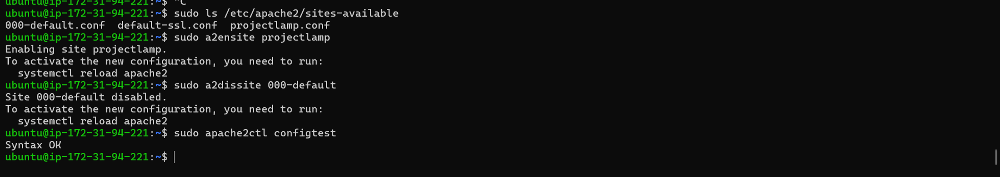

- Finally run: **`sudo systemctl reload apache2`**. This will reload Apache for the changes to take effect.

- To create the **index.html** file with the content **"Hello LAMP from Hardey"** in the /var/www/projectlamp directory, use the following command: **`sudo echo 'Hello LAMP from Hardey' > /var/www/projectlamp/index.html`**.

- I open my web browser and try to access my website using the IP address: **`http://44.197.84.253:80`**

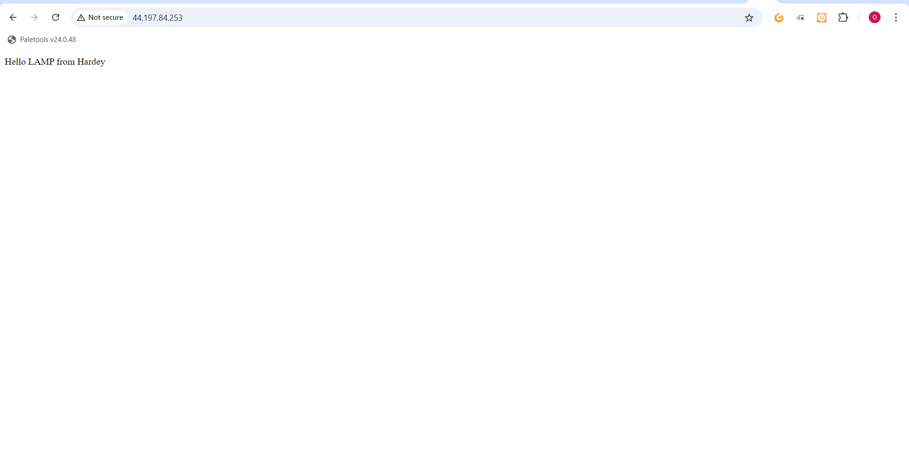

- I remove the index.html file by running the following command: **`sudo rm /var/www/projectlamp/index.html `**

### Enable PHP On The Website

I will be editing the default Directory index settings on Apache.
The default on was.

 - **DirectoryIndex index.html index.cgi index.pl index.php index.xhtml index.htm**

---

And i will be changing it to this

<IfModule mod_dir.c>
    DirectoryIndex index.php index.html index.cgi index.pl index.xhtml index.htm
</IfModule>


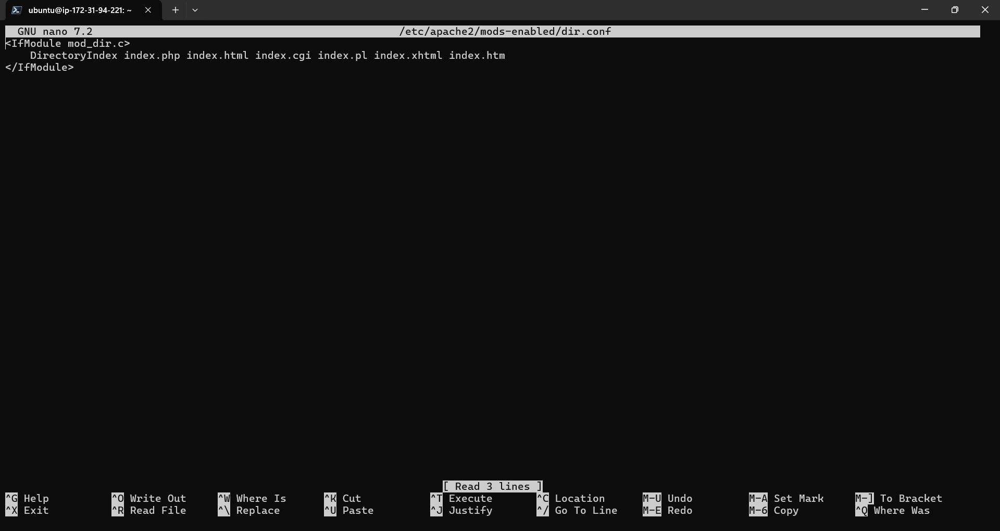

- Finally, I reload Apache for the changes to take effect: **`sudo systemctl reload apache2`**.

Now, Apache will prioritize index.php over index.html when both files exist in the same directory.

- To create a new file named index.php inside your custom web root folder (/var/www/projectlamp), you can use the following command to open it in the nano text editor: **`nano /var/www/projectlamp/index.php`**.

- This will create a new file. i will be putting this PHP code into the new file:

```
<?php

phpinfo();
```
-once i saved and close the file, i will go to my web broswer and refresh the page. Then i got this result.

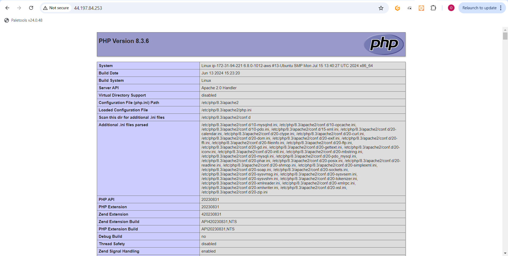

---

### Install Wordpress

After setting up our LAMP environment, we can start installing WordPress. First, we'll download the WordPress installation files and place them in the default web server root directory: **/var/www/html**.

- i will Navigate to the directory using the cd command **`cd /var/www/html`**, and then download the WordPress installation files using the following command: **`sudo wget -c http://wordpress.org/latest.tar.gz`**

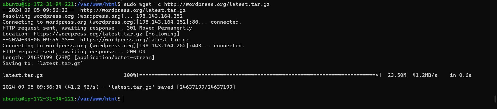

 Extract the files from the downloaded WordPress archive using the command: **`sudo tar -xzvf latest.tar.gz`**

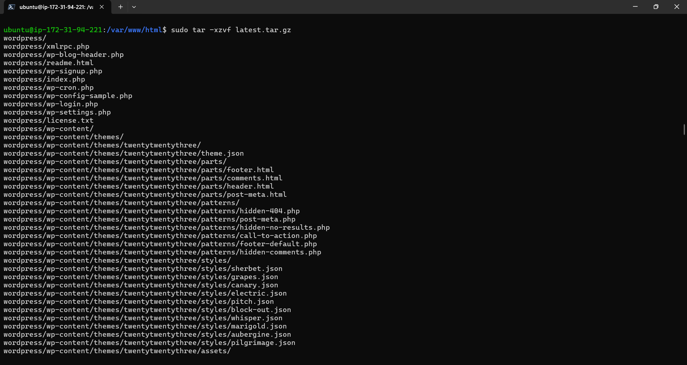

- Run the command **`ls -l`** to confirm the existence of the **wordpress** directory in the current location (`/var/www/html`).

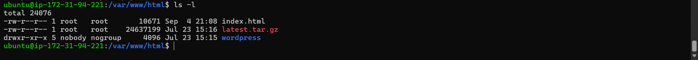

- Check the user running my web server with the command: **`ps aux | grep apache | grep -v grep`**.


*This command filters processes related to Apache (apache2 on Ubuntu) and displays information about the user running those processes.*

- Grant ownership of the WordPress directory and its files to the web server user **(www-data)** by running the command: **`sudo chown -R www-data:www-data /var/www/html/wordpress`**.

### Create a Database For Wordpress

- Access my MySQL root account with the following command: **`sudo mysql -u root -p`①**. Enter the **password②** i set earlier when prompted.

- I create a separate database named wp_db for WordPress to manage, i execute the following command in the MySQL prompt: **`CREATE DATABASE wp_db;`**

- To access the new database, i create a MySQL user account with a strong password using the following command:
**`CREATE USER hardey@localhost IDENTIFIED BY 'wp-password';`**

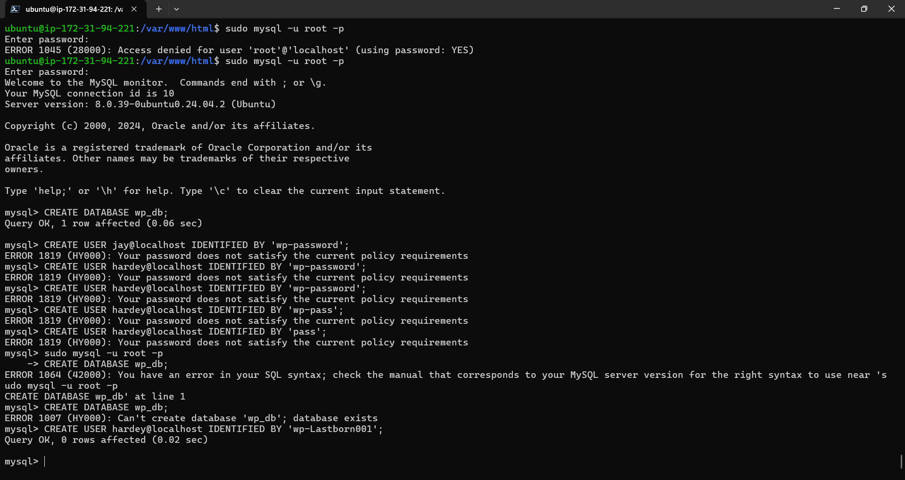

- To grant your created user (hardey@localhost) all privileges needed to work with the wp_db database in MySQL, i use the following commands:

```
GRANT ALL PRIVILEGES ON wp_db.* TO hardey@localhost;
FLUSH PRIVILEGES;
```
 - I Type **`exit`** to exit the MySQL shell.

 - Grant executable permissions recursively (-R) to the wordpress folder using the following command: **`sudo chmod -R 777 wordpress/`**

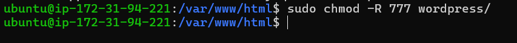

- i Change into the WordPress directory by running the command: **`cd wordpress`**.

### Configure Wordpress

Once i established a database for WordPress, the next crucial step is setting up and configuring WordPress itself. To begin, i need to create a configuration file tailored for WordPress.

- Rename the sample WordPress configuration file with the command: **`mv wp-config-sample.php wp-config.php`**.

- Edit the **`wp-config.php`** file using the command: **`sudo nano wp-config.php`**.

- Update the database settings in the **`wp-config.php`** file by replacing placeholders with my actual database details.

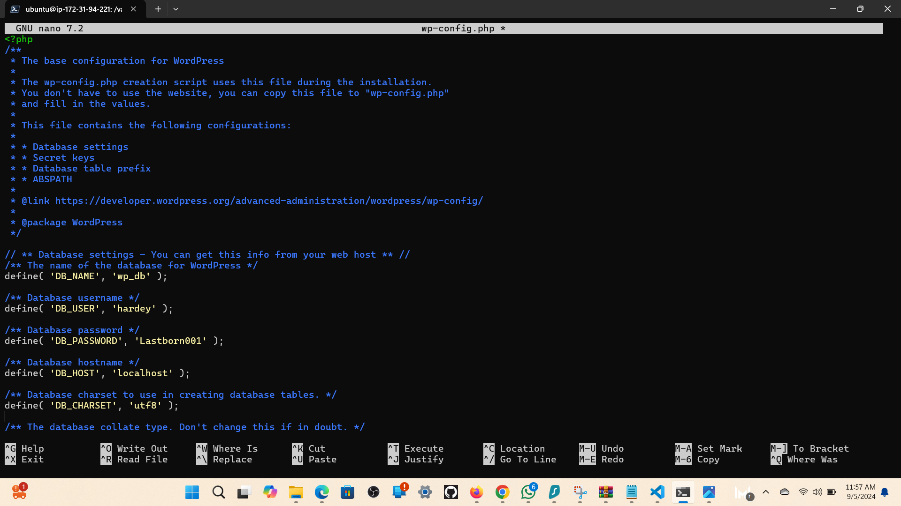

- I modify the configuration file projectlamp.conf: **`sudo nano /etc/apache2/sites-available/projectlamp.conf`** to update the document root to the directory where my WordPress installation is located. I update the document root to **`/var/www/html`** and save my changes.

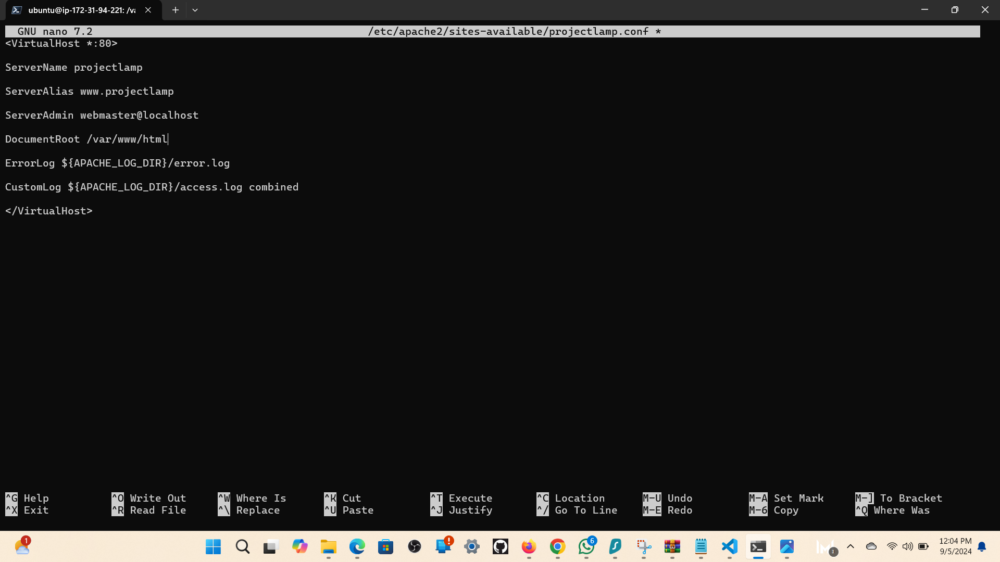

- I reload Apache for the changes to take effect: **`sudo systemctl reload apache2`**.

- I access my wordpress page with **http://100.29.45.56/wordpress/ to complte the installation.

- Select my preferred language and then click on **Continue** to proceed.

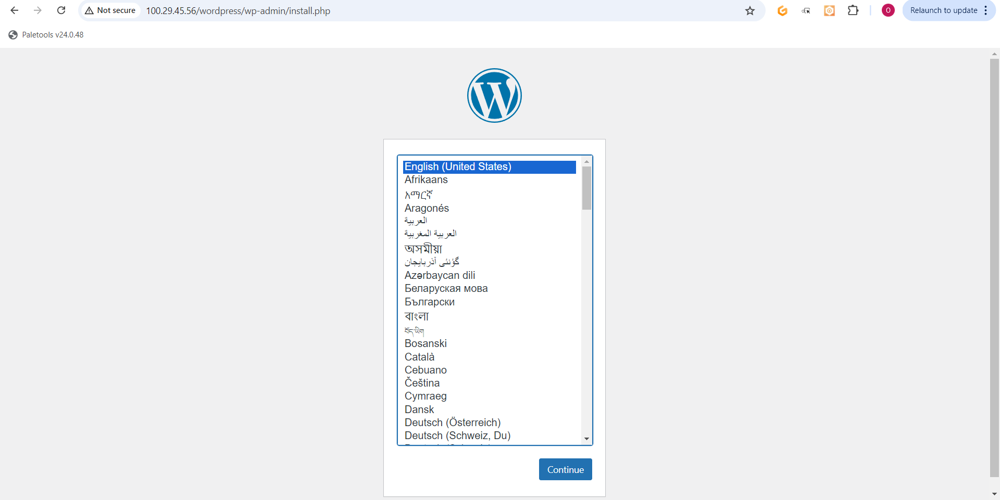

- I enter the required information by following each of the steaps one by one till i get to my login potal.

- I login to my wordpress with my login and password

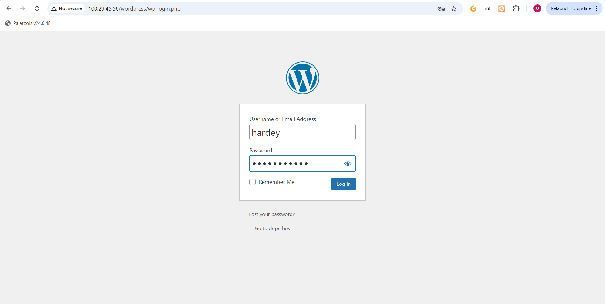

- once i login successfully it brought me to the wordpress dasgboard page.


### Create An A Record

To make my website accessible via my domain, i set up a DNS record with my already host domain.

- Then i point my domain's DNS rocord to the IP address of my Apache load balancer server. 

- In  AWS route 53, i create a record and input my **Ip address** and create record.

- I create another record inputing the record name with **(WWW)**.

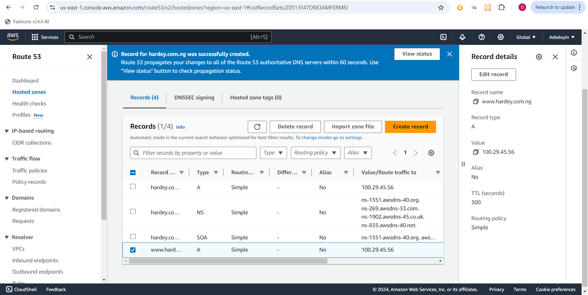

- To update my Apache configuration file in the sites-available directory to point of my domain name, i use the command: **`sudo nano /etc/apache2/sites-available/projectlamp.conf`**.

- I ensure that the server settings in my Apache configuration point to my domain name, and that the document root accurately points to your WordPress directory. Once i made these adjustments, i save the changes and exit the editor.

```
<VirtualHost *:80>
    ServerName <Your root domain name>
    ServerAlias <Your sub domain name>
    ServerAdmin webmaster@<Your root domain name>

    DocumentRoot /var/www/html/wordpress

    <Directory /var/www/html/wordpress>
        Options Indexes FollowSymLinks
       # AllowOverride All
        Require all granted
    </Directory>

    ErrorLog ${APACHE_LOG_DIR}/error.log
    CustomLog ${APACHE_LOG_DIR}/access.log combined
</VirtualHost>

```

- To update your **`wp-config.php`** file with DNS settings, i use the following command: **`sudo nano wp-config.php`** and add these lines to the file:

```
/** MY DNS SETTINGS */
define('WP_HOME', 'http://hardey.com.ng');

define('WP_SITEURL', 'http://hardey.com.ng');
```

- I reload my Apache server to apply the changes with the command: **`sudo systemctl reload apache2`**, After reloading, i visit my website at **`http://hardey.com,ng`** to view my WordPress site. 


Then i login to my Wordpress domain potal with my log in.

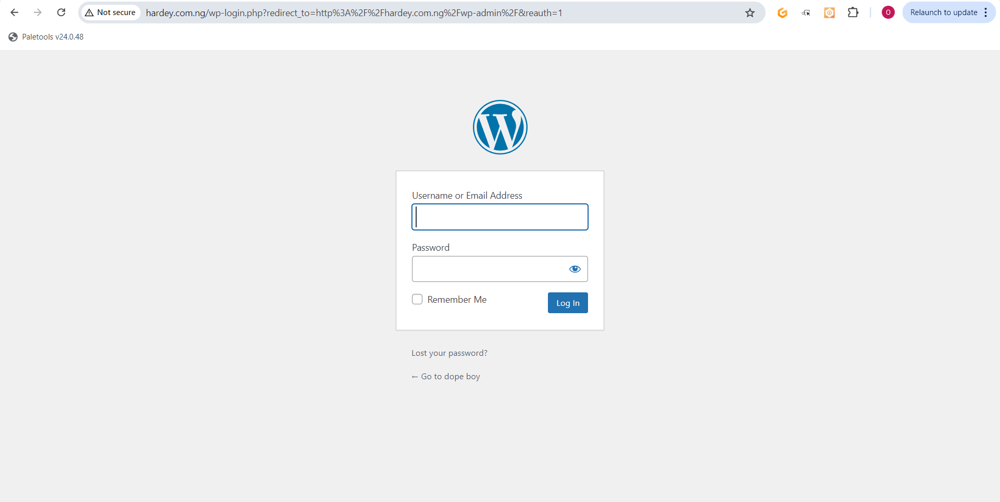

Now that my Wordpress site is successfully configured to my domain name, i will move on to secure it by requesting an SSL/TLS certificate.

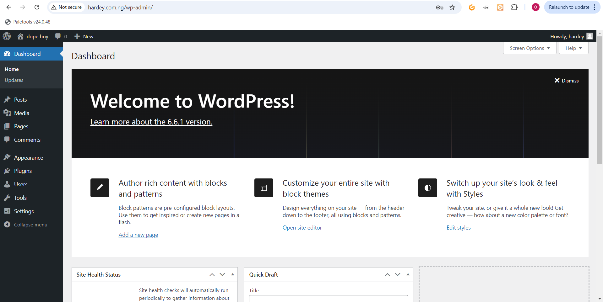

### Install certbot and Request For an SSL/TLS Certificate

- I install certbot by executing the following commands:
`sudo apt update`
`sudo apt install certbot python3-certbot-apache`

- I run the command **`sudo certbot --apache`** to request my SSL/TLS certificate. i Follow the instructions provided by Certbot to select the domain name for which you want to enable HTTPS.

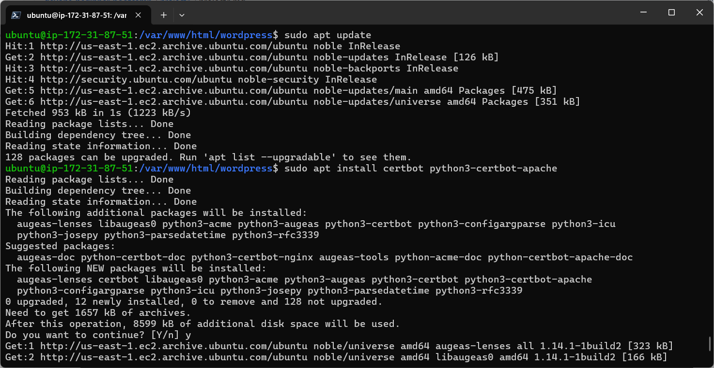

- Once i run my command i receive message confirming that my certificate has been successfully obtained.

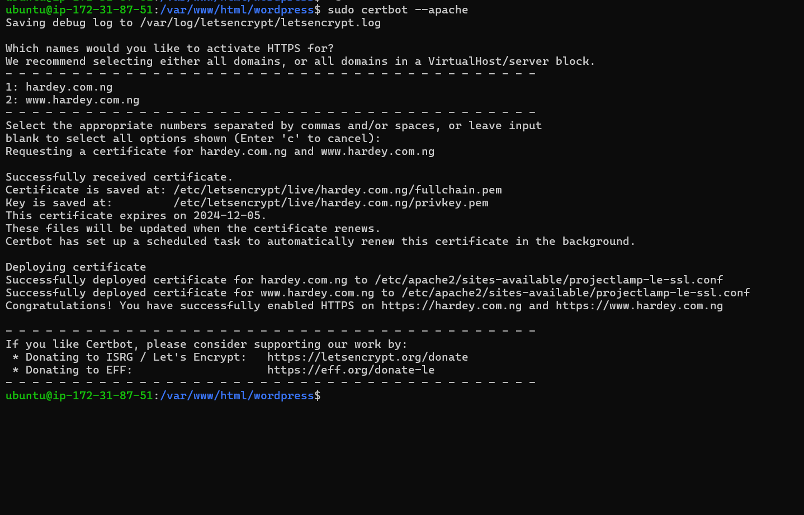

After running my secured command i go back to my website to check if it secure, and when i check it had been secure with HTTPS.


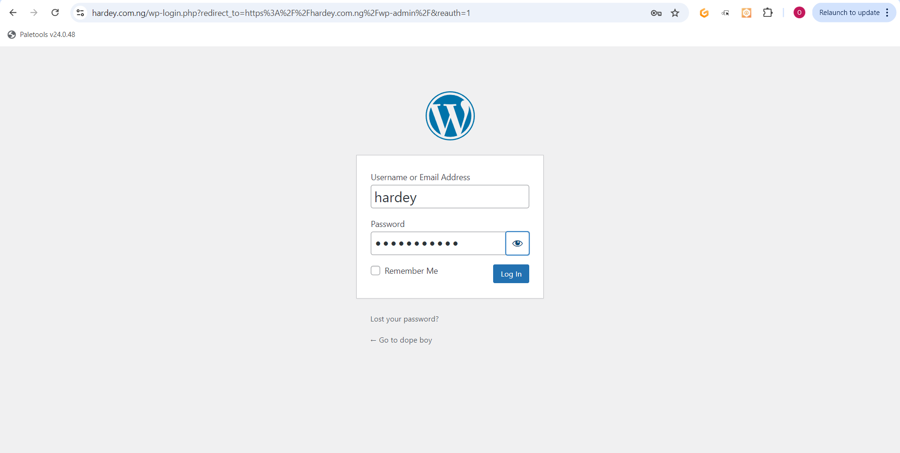

---
---

#### The End Of Project 4