## Project 5

|S/N | Project Tasks                                      |
|----|----------------------------------------------------|
| 1  |Deploy 4 Ubuntu Server                              |
| 2  |Allow required ports in the security group          |
| 3  |Set up architecture                                 |
| 4  |Setup Consul Server                                 |
| 5  |Setup Backend Servers                               |
| 6  |Setup Load-Balancer                                 |
| 7  |Validate Service Discovery Setup                    |

## Key Concepts Covered

- AWS (EC2 and Route 53)
- Linux(Ubuntu)
- Nginx
- Consul
- Environment Setup
- Service Registration with Consul
- Health Checks and Failover
- Load Balancing
- Monitoring and Logging
- Testing and Validation
---


- Deploy 4 Ubuntu Server

Consul server, LoadBalancer server, and the two backend servers.
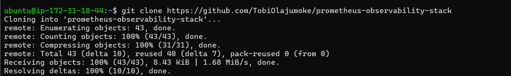

### Allow Required Ports In The Security Group

Setting up all my necessary port.

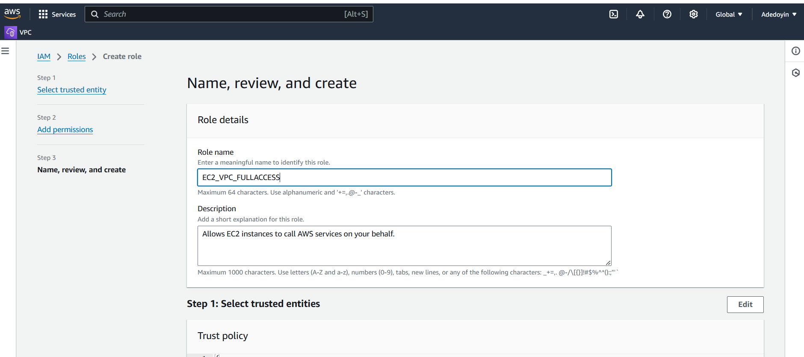

### Setup Consul Server

- SSH into the consul server and run **`sudo apt update`** to refresh the package cache.

- Visit the consul [**downloads**](https://developer.hashicorp.com/consul/install) page to **copy** the installation command.

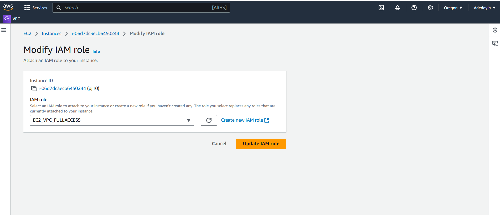

- Confirm my Consul installation by checking its version with the **`consul --version`** command.

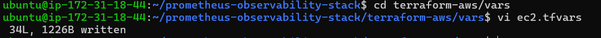

- All the Consul server configurations are located in the **`/etc/consul.d`** folder. To configure the Consul server, start by backing up the default configuration file **`consul.hcl`** by renaming it to **`consul.hcl.back`**, using the following command: **`sudo mv /etc/consul.d/consul.hcl /etc/consul.d/consul.hcl.back`**

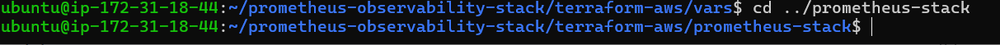

- Generate an **encrypted key** using the **`consul keygen`** command.


- Create a new file named **`consul.hcl`** in the **`/etc/consul.d`** directory, using the following command: **`sudo vi /etc/consul.d/consul.hcl`**

- Adding my Encrypted key with the encrypted key i generated and save my configuration.

```
"bind_addr" = "0.0.0.0"
"client_addr" = "0.0.0.0"
"data_dir" = "/var/consul"
"encrypt" = "MrGGjRYl5aMyi4Hdz08xwogNRB7OruePTv2ILmLqd70="
"datacenter" = "dc1"
"ui" = true
"server" = true
"log_level" = "INFO"
```
- Run the following command to start the Consul server in the background: **`sudo nohup consul agent -dev -config-dir /etc/consul.d/ &`**.


- Checking the status of the Consul server with **`consul members`**.


Here i check my Consul Server to see if it working.


### Setup Backend Servers

Since we have the Consul server up and running, let's manage our Nginx backend servers more easily using service discovery. To do this, we'll install Nginx and the Consul agent on all the backend servers. The Consul agent acts like a messenger, automatically registering both the server and the Nginx service running on it with the Consul server, which acts like a central directory.

**Applying the configurations below on both backend servers:**

- SSH into the backend servers and run **`sudo apt-get update -y`** to update package information.


- Install Nginx on both instances by running **`sudo apt install nginx -y`**.


After installing Nginx, i navigate to the default HTML directory and modify the index.html file on both server.

- Navigate to HTML directory by executing the **`cd /var/www/html`**.

- Open the HTML file with your preferred text editor to make edits: **`sudo vi index.html`**.

- Adding the HTML Content for my both server.

For SERVER-01:

```
<!DOCTYPE html>
<html>
<head>
	<title>Kanekis Backend Server </title>
</head>
<body>
	<h1>This is Backend SERVER-01</h1>
</body>
</html>
```

For SERVER-02

```
<!DOCTYPE html>
<html>
<head>
	<title>Kanekis Backend Server </title>
</head>
<body>
	<h1>This is Backend SERVER-02</h1>
</body>
</html>
```

I verify my Change by checking my IP address.


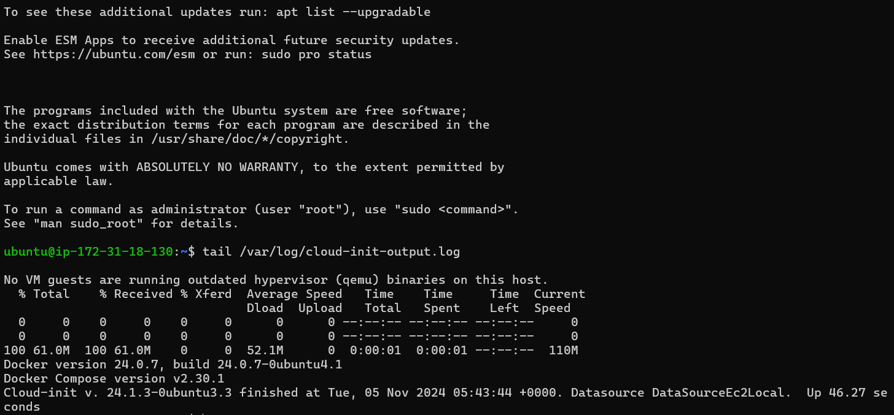

- Install Consul as an agent on both servers.


Verify that Consul is installed properly.


- Replacing the default Consul configuration file **`config.hcl`** located in **`/etc/consul.d`** with your custom **`consul.hcl`** file.


- we need to create a **`backend.hcl`** configuration file in the **`/etc/consul.d`** directory to register the Nginx service and its health check URLs with the Consul server. This will enable the Consul server to continuously monitor the health of the Nginx service. Use the following command to create and edit the file: **`sudo vi /etc/consul.d/backend.hcl`**.

- Add the following contents to the **`backend.hcl`** file and save it.


- I verify my configuration is valid 


Once my both configuration are complte. I run **`sudo nohup consul agent -config-dir /etc/consul.d/ &`**.


I visit my Consul UI to check if everything is working fine and i check my backend.

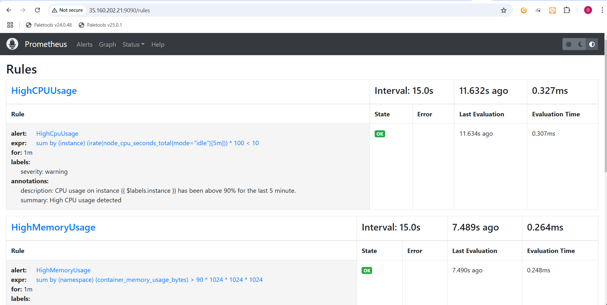

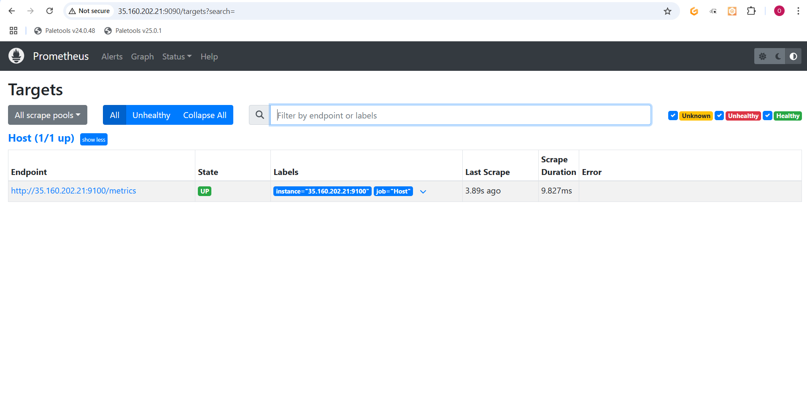
---

### Setup Load-Balancer

Next, set up the load balancer to automatically update its backend server information based on the service registry maintained by Consul.
To retrieve the backend server details, we will use the **`consul-template`** binary. This tool interacts with the Consul server via API calls to fetch the backend server information. It then uses a template to substitute values and generate the **`loadbalancer.conf`** file, which is utilized by Nginx.

- Log in to the load-balancer server. Update the package information and install unzip with the following commands:

```
sudo apt-get update -y
sudo apt-get install unzip -y
```


- Download the consul-template binary


I verify the insrallation of consul-template.

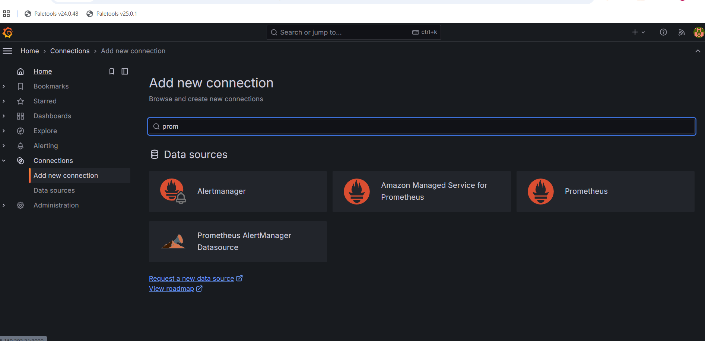

- Create and edit a file named **`load-balancer.conf.ctmpl`** in the **`/etc/nginx/conf.d`** directory, using the following command: **`sudo vi /etc/nginx/conf.d/load-balancer.conf.ctmpl`**.

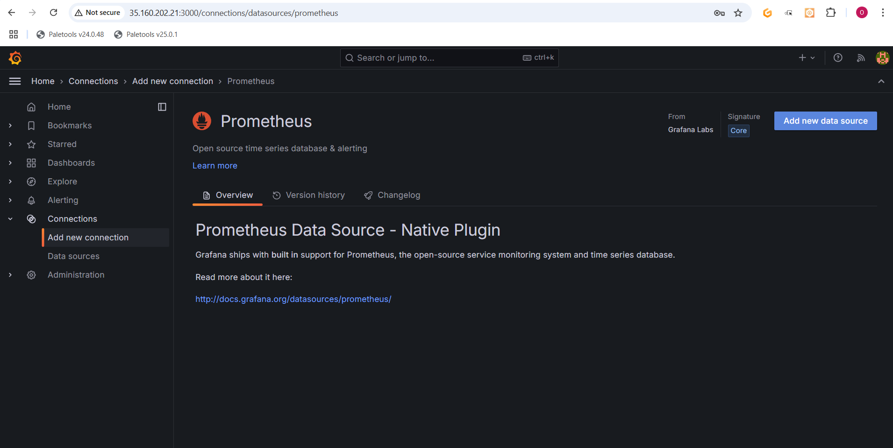

- Create a file named **`consul-template.hcl`** in the **`/etc/nginx/conf.d/`** directory. This configuration file is used by **consul-template** to specify details about the Consul server IP and the destination path where the processed load-balancer.conf file will be saved.

using this comand to create and edit the file:  **`sudo vi /etc/nginx/conf.d/consul-template.hcl`**.


I delete the default server configuration.


I restart Nginx to apply the changes

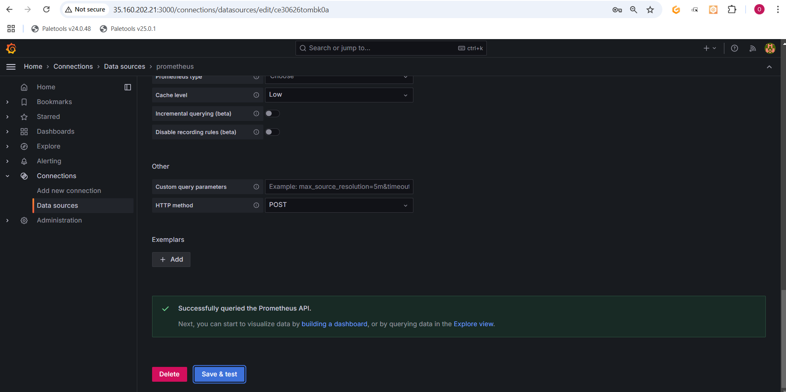

Once i complete my configuration, i start the Templte agent.


After complteing my configuration, i create a load-balancer.conf with my backend server information populated from the Consul service registry.


---

### Service Discovery Test

Now that everything is set up and running, i test the configuration by observing what happens when i stop one of my backend servers.


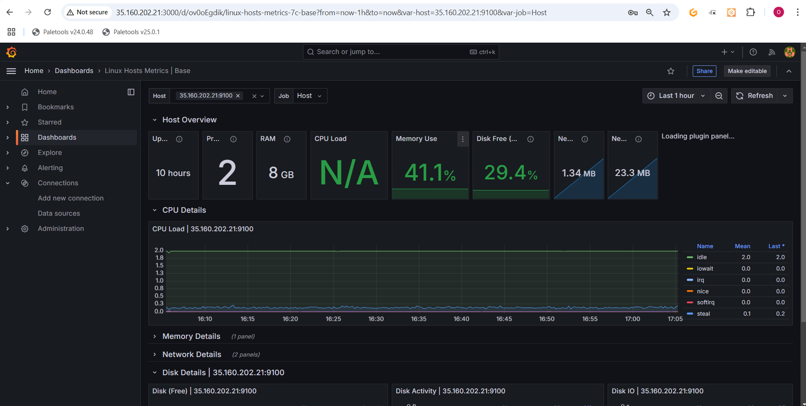


---
---

#### The End Of Project 5