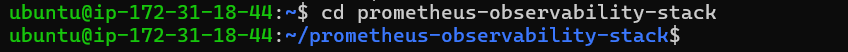

# Flask API Project

---
## What is an API?

### Definition
An API, or Application Programming Interface, is a set of rules that allows different software applications to communicate with each other. Think of it as a messenger that takes requests and tells a system what you want to do, then returns the response back to you.

### Everyday Examples
- **Weather Apps:** When you check the weather on your phone, the app sends a request to a weather service API, which then sends back the weather data.
- **Social Media Sharing:** When you share a YouTube video on Facebook, an API allows Facebook to access the YouTube video data and display it on your timeline.
- **Online Payments:** When you buy something online, an API allows the online store to communicate with your bank to process the payment.

## Why Are APIs Important?

### Modularity
APIs allow different parts of a software system to be developed independently. For example, a mobile app can use an API to interact with a backend server without needing to know how the server works internally.

### Scalability
APIs make it easier to scale applications. You can add more servers or services that communicate via APIs without disrupting the existing system.

### Reusability
APIs enable the reuse of code and services across different applications. For example, a payment processing API can be used by multiple e-commerce websites.

## How Do APIs Work?

### Basic Components
1. **Request:** The client (e.g., your web browser) sends a request to the server. This request usually includes:
   - **Endpoint:** The URL where the API can be accessed.
   - **Method:** The type of action you want to perform (e.g., GET, POST, PUT, DELETE).
   - **Headers:** Additional information sent with the request (e.g., authentication tokens).
   - **Body:** The data sent with the request (for methods like POST or PUT).

2. **Response:** The server processes the request and sends back a response. This response typically includes:
   - **Status Code:** Indicates the result of the request (e.g., 200 for success, 404 for not found).
   - **Headers:** Additional information about the response.
   - **Body:** The data returned by the server (usually in JSON format).

### Example Interaction
Imagine you want to get a list of users from a server:
1. **Request:** Your application sends a GET request to `http://example.com/api/users`.
2. **Response:** The server responds with a list of users in JSON format.

```json
[
  { "id": 1, "name": "Alice" },
  { "id": 2, "name": "Bob" }
]
```

## Types of APIs

### REST (Representational State Transfer)
- **Most Common:** REST APIs use standard HTTP methods (GET, POST, PUT, DELETE).
- **Stateless:** Each request from the client to the server must contain all the information needed to understand and process the request.

### SOAP (Simple Object Access Protocol)
- **Older Protocol:** Uses XML for message format and can be more complex.
- **Highly Secure:** Often used in enterprise-level applications where security and transaction management are crucial.

### GraphQL
- **Newer Query Language:** Allows clients to request exactly the data they need.
- **Flexible:** Reduces the amount of data transferred over the network by allowing more specific queries.

## Key Benefits of APIs
- **Efficiency:** APIs can be used to automate tasks, reducing the need for manual intervention.
- **Innovation:** APIs allow developers to access and integrate new technologies and services easily.
- **Collaboration:** Different teams can work on different parts of a system simultaneously, improving productivity and innovation.

## Setting Up the Project

seting up my VScode and running my terminal on python
- Create the project directory structure using this directory

```
mkdir -p flask_api_project/{templates,static} && touch flask_api_project/app.py flask_api_project/templates/index.html flask_api_project/static/style.css && python -m venv flask_api_project/venv
```

The command above will create the project enviroment

1. **In the `app.py`** file paste the code below
    ```python
    from flask import Flask, request, jsonify, render_template

    app = Flask(__name__)

    users = []

    @app.route('/')
    def home():
        return render_template('index.html')

    @app.route('/users', methods=['POST'])
    def create_user():
        user = request.get_json()
        users.append(user)
        return jsonify(user), 201

    @app.route('/users', methods=['GET'])
    def get_users():
        return jsonify(users), 200

    @app.route('/users/<int:user_id>', methods=['GET'])
    def get_user(user_id):
        user = next((u for u in users if u['id'] == user_id), None)
        return jsonify(user), 200 if user else 404

    @app.route('/users/<int:user_id>', methods=['PUT'])
    def update_user(user_id):
        user = request.get_json()
        index = next((i for i, u in enumerate(users) if u['id'] == user_id), None)
        if index is not None:
            users[index] = user
            return jsonify(user), 200
        return '', 404

    @app.route('/users/<int:user_id>', methods=['DELETE'])
    def delete_user(user_id):
        global users
        users = [u for u in users if u['id'] != user_id]
        return '', 204

    if __name__ == '__main__':
        app.run(debug=True)
    ```

2. **In the `index.html`** in the `templates` directory paste the code below:
    ```html
    <!DOCTYPE html>
    <html lang="en">
    <head>
        <meta charset="UTF-8">
        <meta name="viewport" content="width=device-width, initial-scale=1.0">
        <title>API-Based Application</title>
        <link rel="stylesheet" href="{{ url_for('static', filename='style.css') }}">
    </head>
    <body>
        <h1>User Management</h1>
        <form id="userForm">
            <input type="text" id="name" placeholder="Name" required>
            <input type="email" id="email" placeholder="Email" required>
            <button type="submit">Add User</button>
        </form>
        <ul id="userList"></ul>

        <script>
            document.getElementById('userForm').addEventListener('submit', async function (event) {
                event.preventDefault();
                const name = document.getElementById('name').value;
                const email = document.getElementById('email').value;
                
                const response = await fetch('/users', {
                    method: 'POST',
                    headers: {
                        'Content-Type': 'application/json'
                    },
                    body: JSON.stringify({ name, email })
                });

                const user = await response.json();
                document.getElementById('userList').innerHTML += `<li>${user.name} (${user.email})</li>`;
            });
        </script>
    </body>
    </html>
    ```

3. **In the `style.css`** in the `static` directory paste this code below there:
    ```css
    body {
        font-family: Arial, sans-serif;
        margin: 20px;
    }

    form {
        margin-bottom: 20px;
    }

    input {
        margin-right: 10px;
    }
    ```

    ### Running the Application

```
python -m venv venv
source venv/Scripts/activate
pip install Flask
```

Run your Flask application:
```
flask run
```

I open my broswer http://127.0.0.1:5000 to see my application.





### Testing the API

1. **Using Postman**:
 
    - Create a new request.
    - Set the request type to `POST` and enter `http://127.0.0.1:5000/users`.

    - Go to the Body tab, select `raw`, and choose `JSON` from the dropdown.
    - Enter the JSON data:
        ```json
        {
            "id": 1,
            "name": "adedoyin",
            "email": "hardeydoyin0317@gmail.com"
        }
        ```
    - Click `Send` and check the response.


## End Of Project6
