# The Story of Life Before Docker

Before Docker, deploying applications was cumbersome and often frustrating. Developers faced challenges when transitioning from development to production environments due to inconsistent configurations. Let's imagine a scenario:


#### **The Developer's Struggle:**
shade is a developer who just finished writing a Python web application. It works perfectly on her machine, but as soon as she hands it off to the operations team to deploy on the production server, problems begin to arise.


- **Dependency Hell:** The operations team doesn’t have the exact version of Python or other dependencies needed to run the app. After hours of debugging and configuring, they finally match Sarah's environment, but at the cost of valuable time.
- **Environment Inconsistency:** Sarah’s app used libraries that behave differently on her Mac compared to the Linux servers in production.
- **Scalability Issues:** When the app grows and multiple servers need to run it, each server must be carefully configured to ensure compatibility, which is error-prone and costly.

#### **The Virtual Machine Era:**
To solve these issues, virtual machines (VMs) were introduced. VMs allow developers to package their applications and the entire operating system together, which ensures consistency. However, VMs are heavyweight:
- **Large size:** VMs contain entire operating systems, which consume significant amounts of CPU, RAM, and storage.
- **Slow startup:** Because of the large size, booting up VMs can take several minutes.
- **Inefficiency:** Running multiple VMs on a single server consumes a lot of resources.

Shade's team struggled with these limitations. They needed something faster, more efficient, and easier to manage. Enter **Docker**.

---

### What is Docker?

Docker is a containerization platform that simplifies how applications are built, shared, and run across environments. Containers solve the very problems Shade and her team faced:
- **Lightweight:** Unlike VMs, containers share the host operating system’s kernel, making them significantly smaller and faster.
- **Consistency:** The environment inside a Docker container is identical across development, testing, and production. You can run the same container on your laptop, in the cloud, or anywhere else without worrying about compatibility issues.
- **Portability:** Containers can run on any platform that supports Docker, making applications truly portable.

In essence, Docker allows you to package your app and its dependencies into a small, isolated unit known as a **container**.

---

### How Docker Works

Docker uses a **client-server** architecture:
1. **Docker Client:** The CLI tool you use to interact with Docker.
2. **Docker Daemon:** The background service (or server) that manages images, containers, networks, and volumes.
3. **Docker Images:** A read-only blueprint for creating containers. Think of an image as the recipe and the container as the dish.
4. **Docker Containers:** These are the running instances of images. A container is like a lightweight, isolated environment where your app runs.

---

### Docker Images vs Containers

- **Docker Image:** A static file containing the code, dependencies, and runtime for your app. Images are built from Dockerfiles, which we'll explore shortly.
- **Docker Container:** A container is a live, running instance of an image. You can have multiple containers running from the same image, each operating independently.

### Dockerfile: Building Your First Image

## Step 1 Provision an instance

- Spin up an Ubuntu 24.04 t2.micro this is where we'll be doing the project in

- SSH into the instance 


### Step 2 - Install and start docker


For **Ubuntu**:

1. Update your package index:
   ```bash
   sudo apt update

   ```
 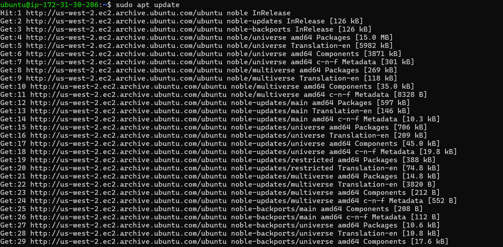

2. Install Docker:
   ```bash
   sudo apt install docker.io -y
   ```
 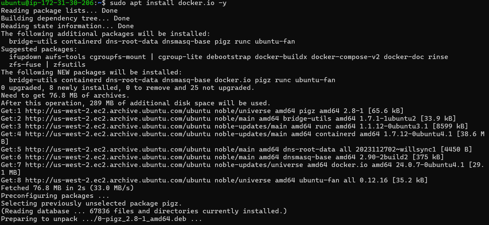

3. Start Docker:

   ```bash
   sudo systemctl start docker
   sudo systemctl enable docker
   ```
 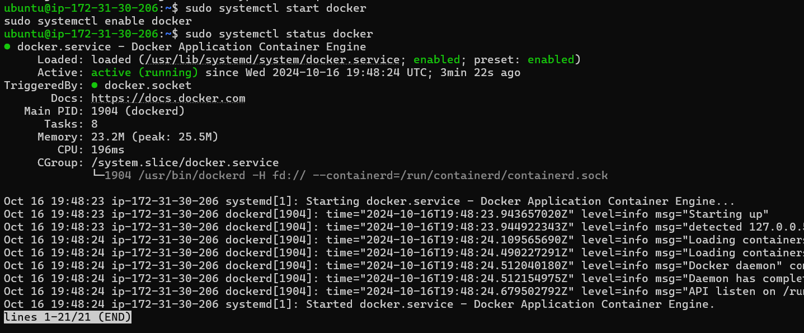

4. Check the Status of Docker
   ```bash
   sudo systemctl status docker
   ```

5. ctrl + c to exit the running docker


### Steps 3. Clone the Docker Project

Once Docker is installed and set up, clone the project repository.

1. Install Git (if not installed):
   ```bash
   
   sudo apt install git -y 
   ```
 


2. Clone the project repository:
   ```bash
   git clone https://github.com/TobiOlajumoke/docker-flask
   cd docker-flask
   ```
 


3. The docker file 
```bash
cat dockerfile
```
 

Let’s break down the `Dockerfile` step by step:

### 1. **ARG PYTHON_VERSION=3.11.6**
- **Explanation**: This defines a build-time variable (`ARG`) that specifies the version of Python to use. Here, it’s set to Python 3.11.6.
- **Why it's useful**: By using an argument, you can easily change the Python version later without altering multiple lines in your `Dockerfile`. It also makes the Dockerfile more flexible.

### 2. **FROM python:${PYTHON_VERSION}-slim as base**
- **Explanation**: This tells Docker to use the official Python image (specifically, a slim version of it) as the base image. The `slim` variant of the Python image is a lightweight version that contains only the essentials for Python.
- **Why it's useful**: Slim images are smaller and faster to download. This improves efficiency in building and running containers.

### 3. **ENV PYTHONDONTWRITEBYTECODE=1**
- **Explanation**: This environment variable prevents Python from writing `.pyc` files (compiled bytecode files).
- **Why it's useful**: By avoiding the creation of bytecode files, you reduce unnecessary writes to the filesystem, which can be especially helpful in container environments where efficiency is key.

### 4. **ENV PYTHONUNBUFFERED=1**
- **Explanation**: This environment variable ensures that Python output is displayed directly to the terminal without buffering.
- **Why it's useful**: In a container environment, you often want logs and outputs to be available immediately for monitoring purposes, so unbuffered output is preferred.

### 5. **WORKDIR /app**
- **Explanation**: This sets the working directory inside the container to `/app`. All subsequent commands in the `Dockerfile` will run from this directory.
- **Why it's useful**: This isolates the app's code and dependencies inside a specific folder, making it easier to organize.

### 6. **ARG UID=10001**
- **Explanation**: This defines a build-time variable to specify the user ID for the application user (`appuser`), set to `10001` by default.
- **Why it's useful**: By specifying a user ID, you improve security by running the application under a non-root user, which minimizes the risk in case of a container breach.

### 7. **RUN adduser ... appuser**
- **Explanation**: This creates a new user (`appuser`) with the specified user ID, but without a password, home directory, or shell access.
- **Why it's useful**: Running processes inside the container as a non-root user (`appuser`) is a best practice for security reasons, as it limits the damage that could be done by a malicious user.

### 8. **COPY requirements.txt .**
- **Explanation**: This copies the `requirements.txt` file (which lists Python dependencies) from your local machine into the container’s `/app` directory.
- **Why it's useful**: This file is required to install the necessary dependencies for the Python application.

### 9. **RUN python -m pip install -r requirements.txt**
- **Explanation**: This command installs all the dependencies listed in `requirements.txt` using Python’s package manager (`pip`).
- **Why it's useful**: This ensures that all required Python libraries are installed inside the container, making the app self-contained.

### 10. **USER appuser**
- **Explanation**: This switches the container's user to `appuser` (the non-root user we created earlier).
- **Why it's useful**: Running the app as a non-root user enhances security by limiting the scope of what can be accessed within the container.

### 11. **COPY . .**
- **Explanation**: This copies all the files from the current directory on your local machine into the `/app` directory inside the container.
- **Why it's useful**: This is how the rest of your application code gets into the container.

### 12. **EXPOSE 8000**
- **Explanation**: This informs Docker (and anyone using the image) that the container will listen for network requests on port 8000.
- **Why it's useful**: This is necessary to expose the correct port to the outside world when running the container.

### 13. **CMD ["gunicorn", "--bind", "0.0.0.0:8000", "hello:app"]**
- **Explanation**: This is the command that runs when the container starts. It launches your Python web application using Gunicorn, which is a WSGI server for Python web apps.
  - `--bind 0.0.0.0:8000`: Tells Gunicorn to bind the app to all network interfaces on port 8000, making it accessible.
  - `hello:app`: This specifies the Python module (`hello`) and the WSGI application instance (`app`) to run. It assumes your Python application file is named `hello.py` and it contains a variable `app` that represents your Flask application.
  
### Step 4. **Run the Docker Application**

1. **Build the Docker Image**:

   ```bash
   docker build -t flask-application:1.0.0 .
   ```
 

- Check if the image built

```bash
sudo docker images
```
 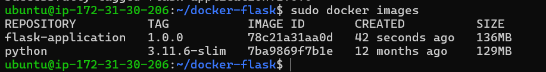

2.  **Run the Docker Container**:
   ```bash
docker run -d -p 8000:8000 flask-application:1.0.0
   ```
 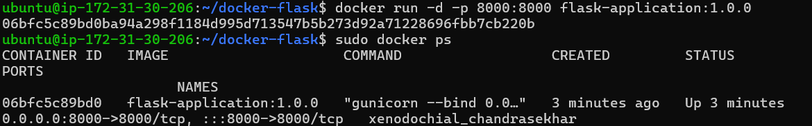


Check if the container is running if it is PROCEED to 3

```bash
sudo docker ps
```

# if the container isn't running check the list of all containers

```bash
sudo docker ps -a
```

To troubleshoot or find out why the container "exited" and isn't running you'll check the container logs by running this command 

```bash
sudo docker logs <container_id_or_name>

```

3.  Test in Browser
Now, go to your browser and access your EC2 public IP to check if the app is running properly:

```bash
http://<your-ec2-public-ip>:8000
```
 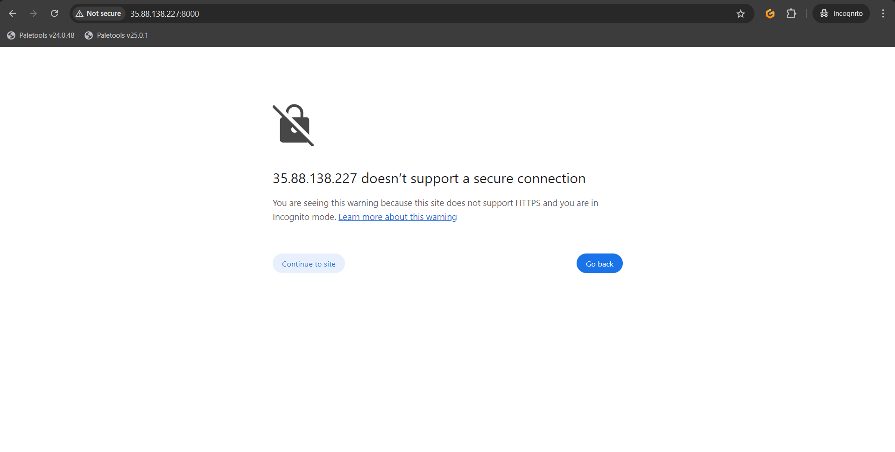

4. The webpage will not work, WHY?

 we have not added the port 8000 to our security group of our instance so do that and try accessing  the EC2 public IP

 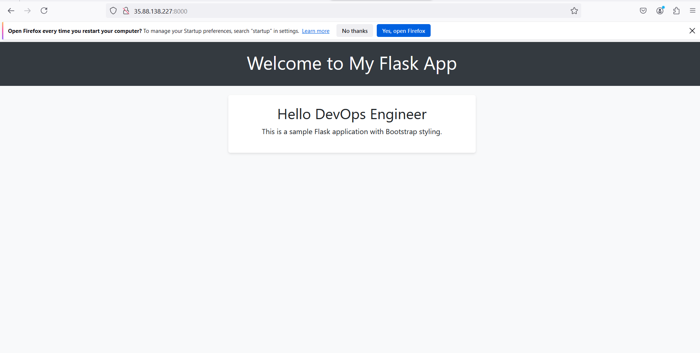

You have successfully deployed the Dockerized Flask app on an AWS EC2 instance. This is a common workflow in modern cloud infrastructure where applications are containerized for ease of deployment, scalability, and management.

# Let's push the image to docker hub

---

### Pushing Docker Images to Docker Hub

After successfully building and running your Docker image, you may want to share it with others or deploy it to different environments. Docker Hub is a cloud-based registry service that allows you to store and distribute Docker images.

#### **Step 1: Create a Docker Hub Account**

1. Go to [Docker Hub](https://hub.docker.com/).
2. Sign up for a free account if you don’t have one already.
 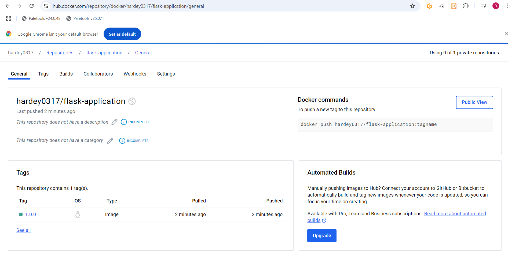
3. create a repo
 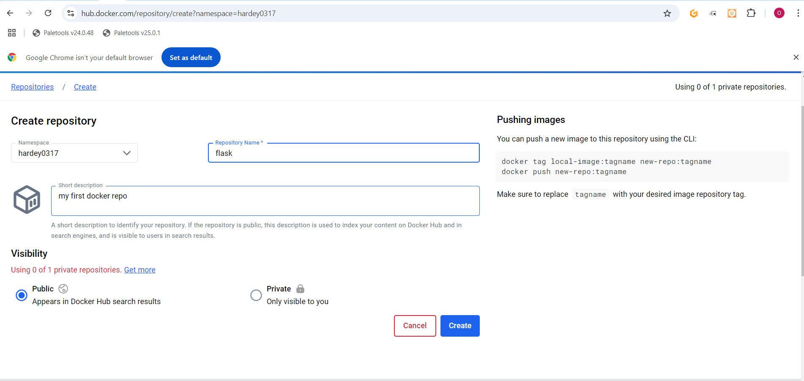

#### **Step 2: Log In to Docker Hub from Your Terminal**

Use the Docker CLI to log in to your Docker Hub account:

```bash
sudo docker login
```
 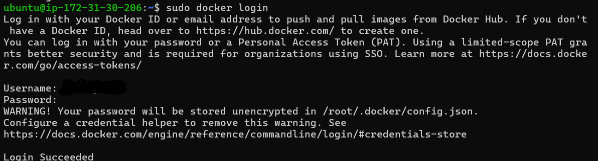

You will be prompted to enter your Docker Hub username and password.

#### **Step 3: Tag Your Image**

Before pushing the image, you need to tag it with your Docker Hub username and a repository name. The tagging format is:

```
<your-dockerhub-username>/<repository-name>:<tag>
```
 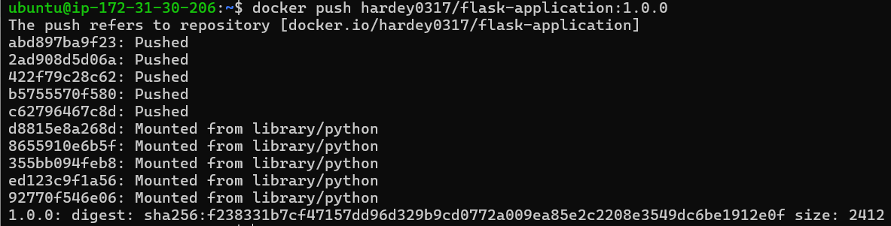

For example:

```bash
sudo docker tag flask-application:1.0.0 yourusername/flask-application:1.0.0
```


**Why Do We Tag Docker Images?**
- **Version Control**: Tagging helps you manage different versions of your images. By using tags, you can easily identify specific versions of your application, which is crucial for testing and deployment.
- **Clarity**: Tags provide clarity about what an image contains. For example, a tag can indicate whether the image is a stable release, a beta version, or a development build.
- **Rollback**: If an issue arises with a new version, you can quickly revert to a previous, stable version using its tag.


#### **Step 4: Push the Image to Docker Hub**

Once your image is tagged, you can push it to Docker Hub using the following command:

```bash
docker push yourusername/flask-application:1.0.0
```


#### **Step 5: Verify the Push**

After the push completes, you can verify that your image is on Docker Hub by visiting your Docker Hub profile and checking the repositories.
 
---

### Why Push to Docker Hub?

- **Collaboration**: Team members can easily access shared images without having to build them from scratch.
- **Backup**: Storing images on Docker Hub acts as a backup, ensuring that you can recover or roll back to previous versions if needed.
- **Deployment**: You can pull images directly from Docker Hub in different environments, simplifying the deployment process.

---

## END OF PROJECT 9
----------